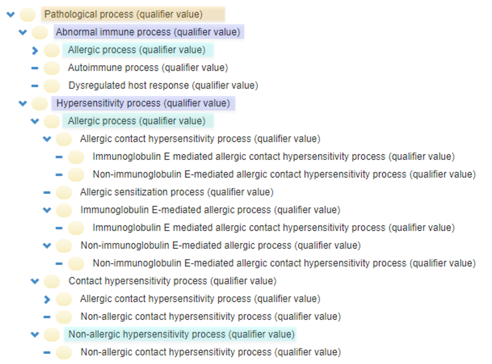
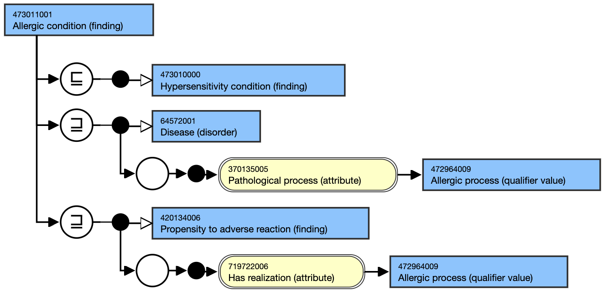
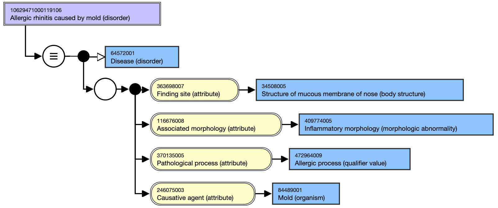
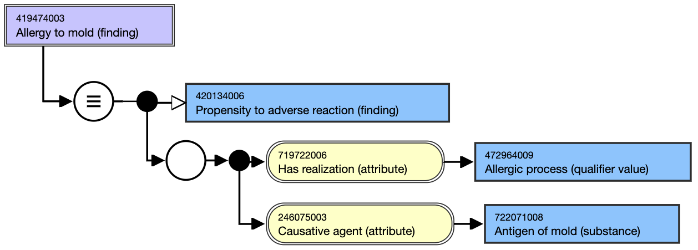
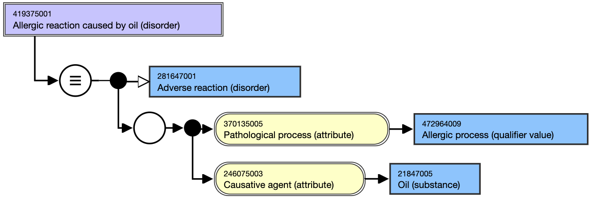
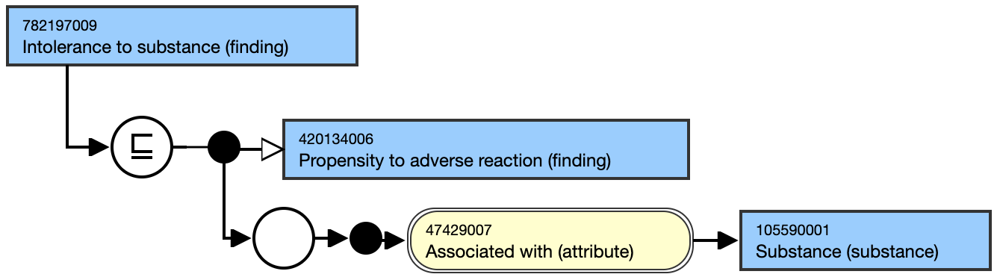

# 3. Allergy Content in SNOMED CT

## SNOMED CT concept model

The SNOMED CT concept model for allergy-related conditions has undergone significant changes (see [Appendix B: Historical SNOMED CT content perspective](180920436.html) for the history of changes). Currently, SNOMED allergy content is organized under the umbrella of hypersensitivity, which is defined by the World Allergy Organization (WAO) as “objectively reproducible symptoms or signs initiated by exposure to a defined stimulus at a dose tolerated by normal persons”. 

Hypersensitivity encompasses both allergy and non-allergic hypersensitivity. The top-level organizing nodes representing hypersensitivity, allergy, and non-allergic hypersensitivity are referred to as conditions (representing disease states), dispositions (propensities to develop a reaction), and processes (pathological processes underlying the reactions). The disjunctive nature of these conditions is modeled using general concept inclusions (GCIs). Hypersensitivity conditions, including allergy and non-allergic hypersensitivity, are defined in terms of a pathologic process relationship to specific processes in the qualifier value hierarchy.

<figure><figcaption>
Figure 3-1: Hierarchical view of the hypersensitivity pathological processes as available in SNOMED CT International Edition version 20220831.
</figcaption></figure>

## Allergic Conditions

Allergic conditions are defined as kinds of hypersensitivity diseases, propensities, and reactions with an immunologic basis and are modeled with a pathologic process of the Allergic process (qualifier value) hierarchy. Allergic process (qualifier value) is a child of both the Hypersensitivity process (qualifier value) and Abnormal immune process (qualifier value), and thus allergic diseases and reactions, unlike their non-allergic counterparts, will classify under both Hypersensitivity condition (finding) and Disorder of immune function. 

Various contact hypersensitivity processes, such as allergic (IgE and non-IgE mediated) and non-allergic, are used to model allergic contact urticaria, allergic contact dermatitis, and irritant contact dermatitis, respectively. 

Concept models for representative allergic conditions are illustrated below (in the stated view). A similar approach is used to model unspecified hypersensitivity and non-allergic hypersensitivity diseases, propensities, and reactions.

<figure><figcaption>
Figure 3-2: Diagrammatic representation in stated view of concept 473011001 |Allergic condition (finding)|as in the International Edition version 20220831.
</figcaption></figure>

  

<figure><figcaption>
Figure 3-3: Diagrammatic representation in stated view of concept 10629471000119106 |Allergic rhinitis caused by mold (disorder)| as in the International Edition version 20220831.
</figcaption></figure>

  

<figure><figcaption>
Figure 3-4: Diagrammatic representation in stated view of concept 419474003 |Allergy to mold (finding)| as in the International Edition version 20220831.
</figcaption></figure>

  

<figure><figcaption>
Figure 3-5: Diagrammatic representation in stated view of concept 419375001 |Allergic reaction caused by oil (disorder)|as in the International Edition version 20220831.
</figcaption></figure>

  

## Intolerance

Intolerance (to a substance) is a propensity to an adverse reaction, which is not an allergy or a non-allergic hypersensitivity, and may be idiosyncratic and/or individually specific (as noted in [FHIR® Release 4](http://hl7.org/fhir/R4/allergyintolerance.html)). [ 782197009 | Intolerance to substance (finding)|](http://snomed.info/id/782197009 "782197009 | Intolerance to substance \(finding\) |") is thus a sibling to [ 609433001 | Hypersensitivity disposition (finding)|](http://snomed.info/id/609433001 "609433001 | Hypersensitivity disposition \(finding\) |") and is modeled as shown below:

<figure><figcaption>
Figure 3-6: Diagrammatic representation in stated view of concept 782197009 |Intolerance to substance (finding)|as in the International Edition version 20230228
</figcaption></figure>

  

  

