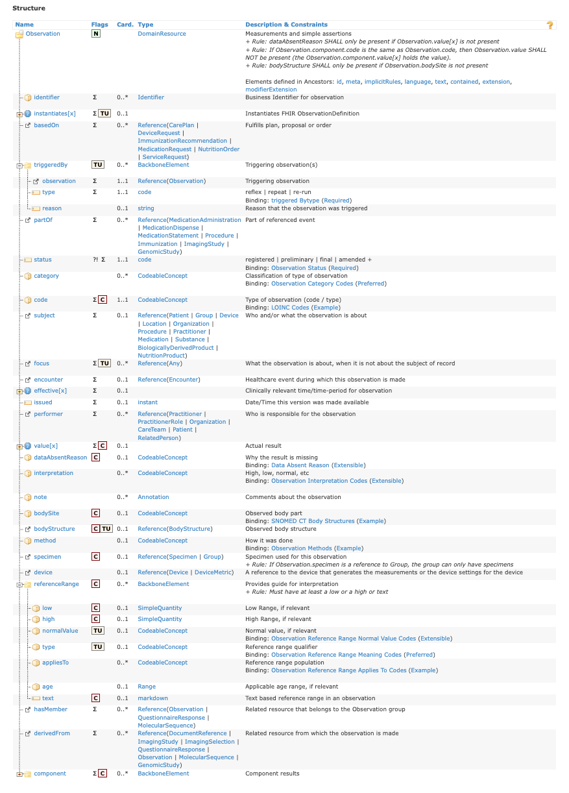

# FHIR model

FHIR® is an HL7® standard for exchanging healthcare information electronically. The fourth STU release (R4) was published in October 2019, including the first (partial) normative content. FHIR models the classes of information for interoperable use as [Resources](https://www.hl7.org/fhir/resource.html). The FHIR® Resources relevant to the use cases in the Information Model and Terminology Binding section are AllergyIntolerance, Condition and Observation.

## AllergyIntolerance resource

The image below shows the structure of the FHIR AllergyIntolerance resource. The full resource model structure, coded elements and terminology bindings of the AllergyIntolerance resource can be found at [http://www.hl7.org/fhir/allergyintolerance.html](http://www.hl7.org/fhir/allergyintolerance.html), with various display options, including UML, XML, JSON, Turtle and the differences it underwent compared to the prior release(s).

<figure><figcaption>
Structure of the AllergyIntolerance HL7 FHIR resource as in HL7® FHIR® v4.3.0: R4B - STU (From http://www.hl7.org/fhir/allergyintolerance.html, consulted on 2nd September 2022).
</figcaption></figure>

The scope of this resource is "A Record of a clinical assessment of an allergy or intolerance; a propensity, or a potential risk to an individual, to have an adverse reaction on future exposure to the specified substance, or class of substance.

Where a propensity is identified, to record information or evidence about a reaction event that is characterized by any harmful or undesirable physiological response that is specific to the individual and triggered by exposure of an individual to the identified substance or class of substance.

Substances include, but are not limited to: a therapeutic substance administered correctly at an appropriate dosage for the individual; food; material derived from plants or animals; or venom from insect stings."

Table: The definition of the main AllergyIntolerance resource elements along with details about their terminology bindings.

<table data-header-hidden><thead><tr><th width="234.03125"></th><th width="227.30859375"></th><th width="135.33203125"></th><th width="103.1640625"></th><th width="307.9296875"></th></tr></thead><tbody><tr><td><strong>Path/Element</strong></td><td><strong>Definition</strong></td><td><strong>Values</strong></td><td><strong>Binding Strength</strong></td><td><strong>Binding</strong></td></tr><tr><td>
AllergyIntolerance.

clinicalStatus
</td><td>The clinical status of the allergy or intolerance.</td><td>- active - inactive - resolved</td><td><a href="http://hl7.org/fhir/terminologies.html#required">Required</a></td><td><a href="http://hl7.org/fhir/valueset-allergyintolerance-clinical.html">AllergyIntoleranceClinicalStatusCodes</a></td></tr><tr><td>
AllergyIntolerance.

verificationStatus
</td><td>Assertion about certainty associated with a propensity, or potential risk, of a reaction to the identified substance.</td><td>-unconfirmed - confirmed - refuted - entered-in-error</td><td><a href="http://hl7.org/fhir/terminologies.html#required">Required</a></td><td><a href="http://hl7.org/fhir/valueset-allergyintolerance-verification.html">AllergyIntoleranceVerificationStatusCodes</a></td></tr><tr><td>AllergyIntolerance.type</td><td>Identification of the underlying physiological mechanism for the reaction risk, if known.</td><td>- allergy - intolerance</td><td><a href="http://hl7.org/fhir/terminologies.html#required">Required</a></td><td><a href="http://hl7.org/fhir/valueset-allergy-intolerance-type.html">AllergyIntoleranceType</a></td></tr><tr><td>AllergyIntolerance.category</td><td>Category of an identified substance associated with allergies or intolerances.</td><td>- food - medication - environment- biologic</td><td><a href="http://hl7.org/fhir/terminologies.html#required">Required</a></td><td><a href="http://hl7.org/fhir/valueset-allergy-intolerance-category.html">AllergyIntoleranceCategory</a></td></tr><tr><td>AllergyIntolerance.criticality</td><td>Estimate of the potential clinical harm, or seriousness, of a reaction to an identified substance.</td><td>- low - high - unable-to-assess</td><td><a href="http://hl7.org/fhir/terminologies.html#required">Required</a></td><td><a href="http://hl7.org/fhir/valueset-allergy-intolerance-criticality.html">AllergyIntoleranceCriticality</a></td></tr><tr><td>AllergyIntolerance.code</td><td>Code for an allergy or intolerance statement (either a positive or a negated/excluded statement). This may be a code for a substance or pharmaceutical product that is considered to be responsible for the adverse reaction risk (e.g., "Latex"), an allergy or intolerance condition (e.g., "Latex allergy"), or a negated/excluded code for a specific substance or class (e.g., "No latex allergy") or a general or categorical negated statement (e.g., "No known allergy", "No known drug allergies").</td><td></td><td><a href="http://hl7.org/fhir/terminologies.html#example">Example</a></td><td><a href="http://hl7.org/fhir/valueset-allergyintolerance-code.html">AllergyIntoleranceSubstance/Product,ConditionAndNegationCodes</a></td></tr><tr><td>AllergyIntolerance.reaction.substance</td><td>Identification of the specific substance (or pharmaceutical product) considered to be responsible for the Adverse Reaction manifestation. It can differ from the AllergyIntolerance.code in some circumstances (ex: reaction to a product containing the substance responsible).</td><td></td><td><a href="http://hl7.org/fhir/terminologies.html#example">Example</a></td><td><a href="http://hl7.org/fhir/valueset-substance-code.html">SubstanceCode</a></td></tr><tr><td>AllergyIntolerance.reaction.manifestation</td><td>Clinical symptoms and/or signs that are observed or associated with an Adverse Reaction Event.</td><td></td><td><a href="http://hl7.org/fhir/terminologies.html#example">Example</a></td><td><a href="http://hl7.org/fhir/valueset-clinical-findings.html">SNOMEDCTClinicalFindings</a></td></tr><tr><td>AllergyIntolerance.reaction.severity</td><td>Clinical assessment of the severity of a reaction event <em>as a whole</em> , potentially considering multiple different manifestations.</td><td>- mild - moderate - severe</td><td><a href="http://hl7.org/fhir/terminologies.html#required">Required</a></td><td><a href="http://hl7.org/fhir/valueset-reaction-event-severity.html">AllergyIntoleranceSeverity</a></td></tr><tr><td>AllergyIntolerance.reaction.exposureRoute</td><td>A coded concept describing the route or physiological path by which the subject was exposed to the substance.</td><td></td><td><a href="http://hl7.org/fhir/terminologies.html#example">Example</a></td><td><a href="http://hl7.org/fhir/valueset-route-codes.html">SNOMEDCTRouteCodes</a></td></tr></tbody></table>

It is important to note that

* In the FHIR® AllergyIntolerance resource, some elements (type, category, criticality and severity) have currently a "Code" data type. They thus require the use of the FHIR values provided and no other classification or terminology code can be used as value in these elements, unless one is using a FHIR® extension, while other elements (clinicalStatus, verificationStatus) have a "CodeableConcept" data type and thus allow for simultaneous use of several code systems (ex: both the FHIR values and the SNOMED CT concepts representing the same meaning as those FHIR values).

[Here](http://build.fhir.org/ig/IHTSDO/snomed-ig/StructureDefinition-allergy-intolerance-detailed-type.html) you will find an example of extension for AllergyIntolerance.type, which allows capturing, in SNOMED CT, more type of reaction values then the two FHIR values of "allergy" and "intolerance".

* When FHIR® R5 is released (expected in late 2022):
  * The reaction.manifestation element should be able to directly reference a FHIR Observation resource representing the manifestation (proposal to be balloted in R5). This will allow the manifestation of an adverse reaction to be recorded only once, not first in an Observation resource and then once again in the AllergyIntolerance resource.
  * The AllergyIntolerance.type element will have a "CodeableConcept" data type and a binding strength of "Preferred", thus allowing the use of SNOMED CT concepts as values without the use of an extension.

## Observation resource

The image below shows the structure of the FHIR Observation resource. The full resource model structure, coded elements and terminology bindings of the Observation resource can be found on [http://www.hl7.org/fhir/observation.html](http://www.hl7.org/fhir/observation.html), with various display options, including UML, XML, JSON, Turtle and the differences it underwent compared to the prior release(s).

<figure><figcaption>
Structure of the Observation HL7 FHIR resource as in HL7® FHIR® v4.3.0: R4B - STU (From http://www.hl7.org/fhir/observation.html, consulted on 2nd September 2022).
</figcaption></figure>

Observations in general are a central element in healthcare, used to support diagnosis, monitor progress, determine baselines and patterns and even capture demographic characteristics. Most observations are simple name/value pair assertions with some metadata, but some observations group other observations together logically, or even are multi-component observations. Note that the [DiagnosticReport](http://www.hl7.org/fhir/diagnosticreport.html) resource provides a clinical or workflow context for a set of observations and the Observation resource is referenced by DiagnosticReport to represent laboratory, imaging, and other clinical and diagnostic data to form a complete report. In the context of allergies, it can be used to present allergy test results.

Uses for the Observation resource include:

* Vital signs such as [body weight](http://www.hl7.org/fhir/observation-example.html), [blood pressure](http://www.hl7.org/fhir/observation-example-bloodpressure.html), and [temperature](http://www.hl7.org/fhir/observation-example-f202-temperature.html)
* **Laboratory Data** like [blood glucose](http://www.hl7.org/fhir/observation-example-f001-glucose.html), or an [estimated GFR](http://www.hl7.org/fhir/observation-example-f205-egfr.html)
* Imaging results like [bone density](http://www.hl7.org/fhir/observation-example-bmd.html) or fetal measurements
* **Clinical Findings** such as [abdominal tenderness](http://www.hl7.org/fhir/observation-example-abdo-tender.html)
* Device measurements such as [EKG data](http://www.hl7.org/fhir/observation-example-sample-data.html) or [Pulse Oximetry data](http://www.hl7.org/fhir/observation-example-satO2.html)
* Clinical assessment tools such as [APGAR](http://www.hl7.org/fhir/observation-example-5minute-apgar-score.html) or a [Glasgow Coma Score](http://www.hl7.org/fhir/observation-example-glasgow.html)
* Personal characteristics: such as [eye-color](http://www.hl7.org/fhir/observation-example-eye-color.html)
* Social history like tobacco use, family support, or cognitive status
* Core characteristics like pregnancy status, or a death assertion

In the context of allergies, the Observation resource can be used to record the manifestation(s) of the allergy (ex: rash on the neck). Note that the boundary between observing a (series of) clinical finding(s) and posing the diagnosis of a disorder isn't always clear cut in medical ontology, and explicit local business rules may be needed to help clinicians record the same clinical situations either as observations or as diagnosis in a consistent way. The Observation resource can also be used to record allergy test results (biological test, like dosage of specific IgE or clinical, like patch and prick tests).

Table: The definition of the main Observation resource elements along with details about their terminology bindings.

<table data-header-hidden><thead><tr><th width="192.6953125"></th><th width="235.45703125"></th><th width="150.546875"></th><th width="101.671875"></th><th></th></tr></thead><tbody><tr><td><strong>Path/Element</strong></td><td><strong>Definition</strong></td><td><strong>Values</strong></td><td><strong>Binding Strength</strong></td><td><strong>Binding</strong></td></tr><tr><td>Observation.status</td><td>The status of the result value.</td><td>- registered - preliminary - final - amended - corrected - cancelled - entered in error - unknown</td><td><a href="http://hl7.org/fhir/terminologies.html#required">Required</a></td><td><a href="http://www.hl7.org/fhir/valueset-observation-status.html">ObservationStatus</a></td></tr><tr><td>Observation.category</td><td>A code that classifies the general type of observation being made.</td><td></td><td><a href="http://www.hl7.org/fhir/terminologies.html#preferred">Preferred</a></td><td><a href="http://www.hl7.org/fhir/valueset-observation-category.html">Observation Category Codes</a></td></tr><tr><td>Observation.code</td><td>Type of observation (code / type). Describes what was observed. Sometimes this is called the observation "name".</td><td></td><td><a href="http://www.hl7.org/fhir/terminologies.html#example">Example</a></td><td><a href="http://www.hl7.org/fhir/valueset-observation-codes.html">LOINC Codes</a></td></tr><tr><td>Observation.dataAbsentReason</td><td>Provides a reason why the expected value in the element Observation.value[x] is missing.</td><td></td><td><a href="http://www.hl7.org/fhir/terminologies.html#extensible">Extensible</a></td><td><a href="http://www.hl7.org/fhir/valueset-data-absent-reason.html">DataAbsentReason</a></td></tr><tr><td>Observation.interpretation</td><td>A categorical assessment of an observation value. For example, high, low, normal.</td><td></td><td><a href="http://www.hl7.org/fhir/terminologies.html#extensible">Extensible</a></td><td><a href="http://www.hl7.org/fhir/valueset-observation-interpretation.html">Observation InterpretationCodes</a></td></tr><tr><td>Observation.bodySite</td><td>Indicates the site on the subject's body where the observation was made (i.e. the target site). May include laterality.</td><td></td><td><a href="http://www.hl7.org/fhir/terminologies.html#example">Example</a></td><td><a href="http://www.hl7.org/fhir/valueset-body-site.html">SNOMED CT Body Structures</a></td></tr><tr><td>Observation.method</td><td>Indicates the mechanism used to perform the observation.</td><td></td><td><a href="http://www.hl7.org/fhir/terminologies.html#example">Example</a></td><td><a href="http://www.hl7.org/fhir/valueset-observation-methods.html">ObservationMethods</a></td></tr><tr><td>Observation.referenceRange.type</td><td>Codes to indicate the what part of the targeted reference population it applies to. For example, the normal or therapeutic range.</td><td></td><td><a href="http://www.hl7.org/fhir/terminologies.html#preferred">Preferred</a></td><td><a href="http://www.hl7.org/fhir/valueset-referencerange-meaning.html">Observation Reference Range MeaningCodes</a></td></tr><tr><td>Observation.referenceRange.appliesTo</td><td>Codes to indicate the target population this reference range applies to. For example, a reference range may be based on the normal population or a particular sex or race.</td><td></td><td><a href="http://www.hl7.org/fhir/terminologies.html#example">Example</a></td><td><a href="http://www.hl7.org/fhir/valueset-referencerange-appliesto.html">bservation Reference Range AppliesToCodes</a></td></tr><tr><td>Observation.component.code</td><td>Type of component observation (code / type). Describes what was observed. Sometimes this is called the observation "code".</td><td></td><td><a href="http://www.hl7.org/fhir/terminologies.html#example">Example</a></td><td><a href="http://www.hl7.org/fhir/valueset-observation-codes.html">LOINC Codes</a></td></tr><tr><td>Observation.component.dataAbsentreason</td><td>Provides a reason why the expected value in the element Observation.component.value[x] is missing.</td><td></td><td><a href="http://www.hl7.org/fhir/terminologies.html#extensible">Extensible</a></td><td><a href="http://www.hl7.org/fhir/valueset-data-absent-reason.html">DataAbsentReason</a></td></tr><tr><td>Observation.component.interpretation</td><td>A categorical assessment of an observation value. For example, high, low, normal.</td><td></td><td><a href="http://www.hl7.org/fhir/terminologies.html#extensible">Extensible</a></td><td><a href="http://www.hl7.org/fhir/valueset-observation-interpretation.html">Observation InterpretationCodes</a></td></tr></tbody></table>

***

## Condition resource

The image below shows the structure of the FHIR Condition resource. The resource model structure, coded elements and terminology bindings of the Condition resource can be found on [http://www.hl7.org/fhir/condition.html](http://www.hl7.org/fhir/condition.html), with various display options, including UML, XML, JSON, Turtle and the differences it underwent compared to the prior release(s).

<figure><figcaption>
 Structure of the Condition HL7 FHIR resource as in HL7® FHIR® v4.3.0: R4B - STU (From http://www.hl7.org/fhir/condition.html, consulted on 2nd September 2022)
</figcaption></figure>

This resource is used to record detailed information about a condition, problem, diagnosis, or other event, situation, issue, or clinical concept that has risen to a level of concern. The condition could be a point in time diagnosis in the context of an encounter, it could be an item on the practitioner’s Problem List, or it could be an additional concern that does not exist on the practitioner’s Problem List. Often a condition is about a clinician's assessment and assertion of a particular aspect of a patient's state of health. It can be used to record information about a disease/illness identified from application of clinical reasoning over the pathologic and pathophysiologic findings (diagnosis), or identification of health issues/situations that a practitioner considers harmful or potentially harmful and may be investigated and managed (problem), or another health issue/situation that may require ongoing monitoring and/or management (health issue/concern).

While conditions are frequently a result of a clinician's assessment and assertion of a particular aspect of a patient's state of health, conditions can also be expressed by the patient, related person, or any care team member. A clinician may have a concern about a patient condition (e.g. anorexia) that the patient is not concerned about. Likewise, the patient may have a condition (e.g. hair loss) that does not rise to the level of importance such that it belongs on a practitioner’s Problem List.

In the context of allergies, the Condition resource can be used to record the manifestation(s) of the allergy (ex: allergic urticaria).

Table: The definition of the main Condition resource elements along with details about their terminology bindings.

<table data-header-hidden><thead><tr><th width="214.95703125"></th><th width="203.3515625"></th><th width="155.48828125"></th><th width="107.13671875"></th><th width="249.11328125"></th></tr></thead><tbody><tr><td><strong>Path/Element</strong></td><td><strong>Definition</strong></td><td><strong>Values</strong></td><td><strong>Binding Strength</strong></td><td><strong>Binding</strong></td></tr><tr><td>Condition.clinicalStatus</td><td>The clinical status of the condition or diagnosis.</td><td>- active - recurrence - relapse - inactive - remission - resolved</td><td><a href="http://hl7.org/fhir/terminologies.html#required">Required</a></td><td><a href="http://www.hl7.org/fhir/valueset-condition-clinical.html">ConditionClinicalStatusCodes</a></td></tr><tr><td>Condition.verificationStatus</td><td>The verification status to support or decline the clinical status of the condition or diagnosis.</td><td>- unconfirmed - provisional - differential - confirmed - refuted - entered-in-error</td><td><a href="http://www.hl7.org/fhir/terminologies.html#required">Required</a></td><td><a href="http://www.hl7.org/fhir/valueset-condition-ver-status.html">ConditionVerificationStatus</a></td></tr><tr><td>Condition.category</td><td>A category assigned to the condition.</td><td></td><td><a href="http://www.hl7.org/fhir/terminologies.html#extensible">Extensible</a></td><td><a href="http://www.hl7.org/fhir/valueset-condition-category.html">ConditionCategoryCodes</a></td></tr><tr><td>Condition.severity</td><td>A subjective assessment of the severity of the condition as evaluated by the clinician.</td><td></td><td><a href="http://www.hl7.org/fhir/terminologies.html#preferred">Preferred</a></td><td><a href="http://www.hl7.org/fhir/valueset-condition-severity.html">Condition/DiagnosisSeverity</a></td></tr><tr><td>Condition.code</td><td>Identification of the condition or diagnosis.</td><td></td><td><a href="http://www.hl7.org/fhir/terminologies.html#example">Example</a></td><td><a href="http://www.hl7.org/fhir/valueset-condition-code.html">Condition/Problem/DiagnosisCodes</a></td></tr><tr><td>Condition.bodySite</td><td>Codes describing anatomical locations. May include laterality.</td><td></td><td><a href="http://www.hl7.org/fhir/terminologies.html#example">Example</a></td><td><a href="http://www.hl7.org/fhir/valueset-body-site.html">SNOMEDCTBodyStructures</a></td></tr><tr><td>Condition.stage.summary</td><td>Codes describing condition stages (e.g. Cancer stages).</td><td></td><td><a href="http://www.hl7.org/fhir/terminologies.html#example">Example</a></td><td><a href="http://www.hl7.org/fhir/valueset-condition-stage.html">ConditionStage</a></td></tr><tr><td>Condition.stage.type</td><td>Codes describing the kind of condition staging (e.g. clinical or pathological).</td><td></td><td><a href="http://www.hl7.org/fhir/terminologies.html#example">Example</a></td><td><a href="http://www.hl7.org/fhir/valueset-condition-stage-type.html">ConditionStageType</a></td></tr><tr><td>Condition.evidence.code</td><td>Codes that describe the manifestation or symptoms of a condition.</td><td></td><td><a href="http://www.hl7.org/fhir/terminologies.html#example">Example</a></td><td><a href="http://www.hl7.org/fhir/valueset-manifestation-or-symptom.html">ManifestationAndSymptomCodes</a></td></tr></tbody></table>

***

**Example of a typical Medication allergy resource from a clinical system (id = "medication") (JSON form**

<pre class="language-json"><code class="lang-json"><strong> {
</strong>  "resourceType": "AllergyIntolerance",
  "id": "medication",
  "text": {
    "status": "generated",
    "div": "&#x3C;div xmlns=\"http://www.w3.org/1999/xhtml\">&#x3C;p>&#x3C;b>Generated Narrative with Details&#x3C;/b>&#x3C;/p>&#x3C;p>&#x3C;b>id&#x3C;/b>: medication&#x3C;/p>&#x3C;p>&#x3C;b>clinicalStatus&#x3C;/b>: Active &#x3C;span>(Details : {http://terminology.hl7.org/CodeSystem/allergyintolerance-clinical code 'active' = 'Active', given as 'Active'})&#x3C;/span>&#x3C;/p>&#x3C;p>&#x3C;b>verificationStatus&#x3C;/b>: Unconfirmed &#x3C;span>(Details : {http://terminology.hl7.org/CodeSystem/allergyintolerance-verification code 'unconfirmed' = 'Unconfirmed', given as 'Unconfirmed'})&#x3C;/span>&#x3C;/p>&#x3C;p>&#x3C;b>category&#x3C;/b>: medication&#x3C;/p>&#x3C;p>&#x3C;b>criticality&#x3C;/b>: high&#x3C;/p>&#x3C;p>&#x3C;b>code&#x3C;/b>: Penicillin G &#x3C;span>(Details : {RxNorm code '7980' = 'Penicillin G', given as 'Penicillin G'})&#x3C;/span>&#x3C;/p>&#x3C;p>&#x3C;b>patient&#x3C;/b>: &#x3C;a>Patient/example&#x3C;/a>&#x3C;/p>&#x3C;p>&#x3C;b>recordedDate&#x3C;/b>: 01/03/2010&#x3C;/p>&#x3C;p>&#x3C;b>recorder&#x3C;/b>: &#x3C;a>Practitioner/13&#x3C;/a>&#x3C;/p>&#x3C;h3>Reactions&#x3C;/h3>&#x3C;table>&#x3C;tr>&#x3C;td>-&#x3C;/td>&#x3C;td>&#x3C;b>Manifestation&#x3C;/b>&#x3C;/td>&#x3C;/tr>&#x3C;tr>&#x3C;td>*&#x3C;/td>&#x3C;td>Hives &#x3C;span>(Details : {SNOMED CT code '247472004' = 'Weal', given as 'Hives'})&#x3C;/span>&#x3C;/td>&#x3C;/tr>&#x3C;/table>&#x3C;/div>"
  },
  "clinicalStatus": {
    "coding": [
      {
        "system": "http://terminology.hl7.org/CodeSystem/allergyintolerance-clinical",
        "code": "active",
        "display": "Active"
      }
    ]
  },
  "verificationStatus": {
    "coding": [
      {
        "system": "http://terminology.hl7.org/CodeSystem/allergyintolerance-verification",
        "code": "unconfirmed",
        "display": "Unconfirmed"
      }
    ]
  },
  "category": [
    "medication"
  ],
  "criticality": "high",
  "code": {
    "coding": [
      {
        "system": "http://www.nlm.nih.gov/research/umls/rxnorm",
        "code": "7980",
        "display": "Penicillin G"
      }
    ]
  },
  "patient": {
    "reference": "Patient/example"
  },
  "recordedDate": "2010-03-01",
  "recorder": {
    "reference": "Practitioner/13"
  },
  "reaction": [
    {
      "manifestation": [
        {
          "coding": [
            {
              "system": "http://snomed.info/sct",
              "code": "247472004",
              "display": "Hives"
            }
          ]
        }
      ]
    }
  ]
}           
</code></pre>

## Using SNOMED CT concepts in FHIR® resources

The SNOMED on FHIR group can provide help and direction on how to deal with the specific issues that may arise when using SNOMED CT concepts in FHIR® resources. SNOMED CT implementation in FHIR guidance can be found here: [http://build.fhir.org/ig/IHTSDO/snomed-ig/](http://build.fhir.org/ig/IHTSDO/snomed-ig/), while proposals of SNOMED CT adapted FHIR resources can be found here: [http://build.fhir.org/ig/IHTSDO/snomed-ig/profiles.html](http://build.fhir.org/ig/IHTSDO/snomed-ig/profiles.html).

You will note that there are two separate FHIR® profiles proposed on this page, based on the general HL7 FHIR AllergyIntolerance resource. One is substance-focused, meaning that the record centers for the AllergyIntolerance.code value on the substance the patient reacts to and captures separately the type of reaction in the AllergyIntolerance.type element. One can say this model captures the allergy/intolerance to X in a post-coordinated way. The second profile is finding-focused, meaning it captures the allergy/intolerance in the AllergyIntolerance.code element using pre-coordinated "allergy/intolerance to X" SNOMED CT concepts and makes no use of the AllergyIntolerance.type element.
