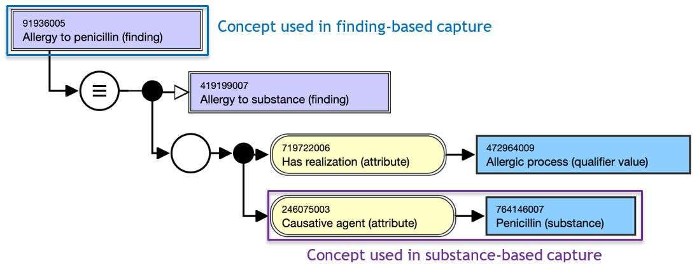
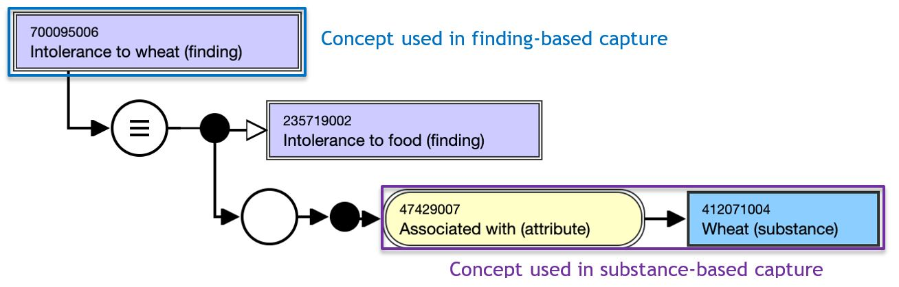
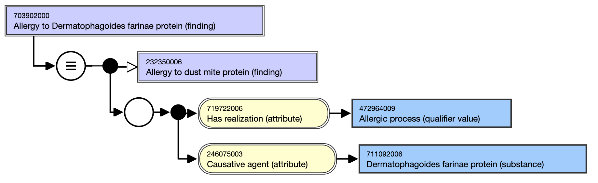
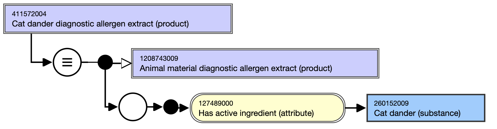
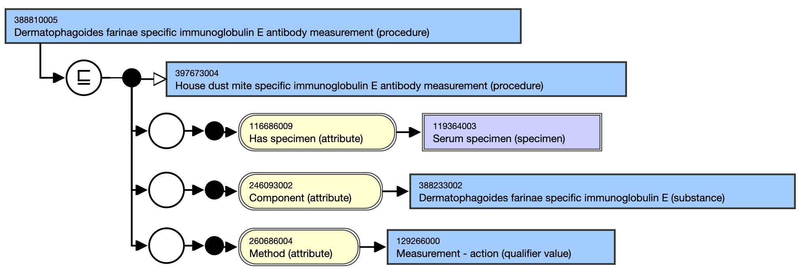
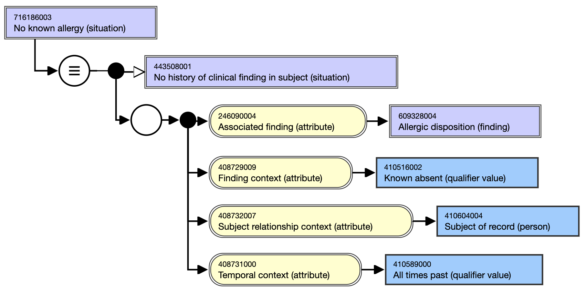

# Examples

## Use Case 1: Documentation of Information Related to Allergy, Hypersensitivity, and Intolerance

## Scenario 1.1 Documentation of an adverse reaction to a drug substance

**Scenario** : A physician sees a patient in clinic for routine outpatient care. Recently the patient was prescribed penicillin V 500 mg orally two times daily x 10 days for streptococcal pharyngitis. He tells the physician that he has developed hives the previous week and on examination, the physician confirms the presence of generalized hives. He records this in the patient record as an Observation.

#### **FHIR Observation resource query from patient record (see FHIR representation** [**here**](http://build.fhir.org/ig/IHTSDO/snomed-ig/Observation-AllergyObservationExample1-1.html)**)**

<table><thead><tr><th width="196.84375">Attribute</th><th width="269.0078125">Value</th><th>SNOMED CT Concept</th></tr></thead><tbody><tr><td>code*</td><td>LOINC: 80343-7 | Skin assessment [Interpretation] |</td><td>271303006 | Examination of skin (procedure) |</td></tr><tr><td>status</td><td>final</td><td>-</td></tr><tr><td>category</td><td>Exam</td><td>-</td></tr><tr><td>valueCodableConcept</td><td></td><td>247472004 | Wheal (finding) |</td></tr><tr><td>bodySite</td><td></td><td>39937001 | Skin structure (body structure) |</td></tr></tbody></table>

\*LOINC codes are the recommended coding system for the FHIR observation.code element but the observation.code being a CodableConcept, one may choose also to use SNOMED CT concepts to represent the value in this field.

A review of systems fails to reveal any other causes and the physician believes that the patient may be having an urticarial reaction to penicillin. He has lingering uncertainty about this and tells the patient to stop the penicillin and employ diphenhydramine for relief. He schedules him back in a week for follow-up and when recording his note for the visit, he adds to his assessment in the problem list: “Moderate urticarial reaction, possible penicillin allergy”.

**FHIR Condition resource query from patient record (see FHIR representation** [**here**](http://build.fhir.org/ig/IHTSDO/snomed-ig/Condition-AllergyConditionExample1-1.html)**)**

<table><thead><tr><th width="173.0234375">Attribute</th><th width="191.9453125">Value</th><th>SNOMED CT concept</th></tr></thead><tbody><tr><td>code</td><td>Urticarial reaction</td><td>126485001 <mark style="color:blue;">|</mark>Urticaria (disorder)<mark style="color:blue;">|</mark></td></tr><tr><td>clinicalStatus</td><td>active</td><td>55561003 <mark style="color:blue;">|</mark>Active (qualifier value)<mark style="color:blue;">|</mark></td></tr><tr><td>verificationStatus</td><td>confirmed</td><td>410605003 <mark style="color:blue;">|</mark>Confirmed present (qualifier value)<mark style="color:blue;">|</mark></td></tr><tr><td>category</td><td>problem-list-item</td><td>-</td></tr><tr><td>severity</td><td>moderate</td><td>6736007 <mark style="color:blue;">|</mark>Moderate (severity modifier) (qualifier value)<mark style="color:blue;">|</mark></td></tr><tr><td>bodySite</td><td> </td><td>39937001 <mark style="color:blue;">|</mark>Skin structure (body structure)<mark style="color:blue;">|</mark></td></tr></tbody></table>

A week later, the patient returns for follow-up with the itching and rash entirely resolved. He reports that the reaction subsided within days after stopping the penicillin. The physician adds “Penicillin allergy probable: moderate reaction of hives; criticality unable-to-assess” to the allergy list.

**FHIR resource query from patient record (see FHIR representation** [**here**](http://build.fhir.org/ig/IHTSDO/snomed-ig/AllergyIntolerance-AllergyIntoleranceExample1-2.html)**); EHR using a** [**substance focused AllergyIntolerance resource**](http://build.fhir.org/ig/IHTSDO/snomed-ig/StructureDefinition-AllergyIntolerance-SubstanceFocused.html)

<table><thead><tr><th width="221.81640625">Attribute</th><th width="155.05078125">FHIR code</th><th width="349.24609375">SNOMED CT concept</th></tr></thead><tbody><tr><td>code</td><td> </td><td>764146007 <mark style="color:blue;">|</mark>Penicillin (substance)<mark style="color:blue;">|</mark></td></tr><tr><td>type</td><td>allergy</td><td>609328004 <mark style="color:blue;">|</mark>Allergic disposition (finding)|*</td></tr><tr><td>clinicalStatus</td><td>active</td><td>55561003 <mark style="color:blue;">|</mark>Active (qualifier value)<mark style="color:blue;">|</mark></td></tr><tr><td>verificationStatus</td><td>unconfirmed</td><td>415684004 <mark style="color:blue;">|</mark>Suspected (qualifier value)<mark style="color:blue;">|</mark></td></tr><tr><td>category</td><td>medication</td><td>-</td></tr><tr><td>criticality</td><td>unable-to-assess</td><td>-</td></tr><tr><td>reaction.manifestation</td><td> </td><td>247472004 <mark style="color:blue;">|</mark>Wheal (finding)<mark style="color:blue;">|</mark></td></tr><tr><td>reaction.severity</td><td>moderate</td><td>6736007 <mark style="color:blue;">|</mark>Moderate (severity modifier) (qualifier value)<mark style="color:blue;">|</mark>*</td></tr><tr><td>reaction.exposureRoute</td><td> </td><td>26643006 <mark style="color:blue;">|</mark>Oral route (qualifier value)<mark style="color:blue;">|</mark></td></tr></tbody></table>

Or

**FHIR resource query from patient record (see FHIR representation** [**here**](http://build.fhir.org/ig/IHTSDO/snomed-ig/AllergyIntolerance-AllergyIntoleranceExample1-2-alt.html)**); EHR using a** [**finding focused AllergyIntolerance resource**](http://build.fhir.org/ig/IHTSDO/snomed-ig/StructureDefinition-AllergyIntolerance-FindingFocused.html)

<table><thead><tr><th width="206.58203125">Attribute</th><th width="181.5546875">FHIR code</th><th>SNOMED CT concept</th></tr></thead><tbody><tr><td>code</td><td> </td><td>91936005 <mark style="color:blue;">|</mark>Allergy to penicillin (finding)<mark style="color:blue;">|</mark></td></tr><tr><td>type</td><td>-</td><td>-</td></tr><tr><td>clinicalStatus</td><td>active</td><td>55561003 <mark style="color:blue;">|</mark>Active (qualifier value)<mark style="color:blue;">|</mark></td></tr><tr><td>verificationStatus</td><td>unconfirmed</td><td>415684004 <mark style="color:blue;">|</mark>Suspected (qualifier value)<mark style="color:blue;">|</mark></td></tr><tr><td>category</td><td>medication</td><td>-</td></tr><tr><td>criticality</td><td>unable-to-assess</td><td>-</td></tr><tr><td>reaction.manifestation</td><td> </td><td>247472004 <mark style="color:blue;">|</mark>Wheal (finding)<mark style="color:blue;">|</mark></td></tr><tr><td>reaction.severity</td><td>moderate</td><td>6736007 <mark style="color:blue;">|</mark>Moderate (severity modifier) (qualifier value)<mark style="color:blue;">|</mark>*</td></tr><tr><td>reaction.exposureRoute</td><td> </td><td>26643006 <mark style="color:blue;">|</mark>Oral route (qualifier value)<mark style="color:blue;">|</mark></td></tr></tbody></table>

\*The use of a SNOMED CT concept to represent these values requires the use of a FHIR extension in HL7® FHIR® v4.3.0: R4B - STU (see 2.2.3.1).

<figure><figcaption>
SNOMED CT inferred definition of concept 91936005 |Allergy to penicillin (finding)|as in the International Edition version 20220831.
</figcaption></figure>

## Scenario 1.2 Documentation in drug allergy list by provider and use as allergy alert

**Scenario** : Several years later, the same patient who has since received an aortic valve replacement is seeing another physician within the organization for consultation on antibiotic prophylaxis for an upcoming dental procedure. The second physician decides that a penicillin class antibiotic is appropriate for the patient.

When the physician creates an order for amoxicillin 2 g orally as a single dose and commits to the electronic prescription, an alert appears which requires a response by the physician warning him of an allergy history to penicillin. The substance-based alert is generated by the EHR drug-disease interactions software, which uses the Allergy list as a reference. As the patient has not received penicillin class antibiotics for several years, the physician decides to refer the patient to an allergy specialist for clarification of current status of penicillin allergy.

The specialist performs skin testing for penicillin allergy, the results of which are positive. The patient is confirmed as penicillin allergic and the results of the testing are documented in the patient’s medical record.

The patient is subsequently prescribed azithromycin for his dental procedure.

**FHIR Observation resource for the positive skin test (see FHIR representation** [**here**](http://build.fhir.org/ig/IHTSDO/snomed-ig/Observation-AllergyObservationExample2.html)**)**

<table><thead><tr><th width="187.13671875">Attribute</th><th width="113.9296875">FHIR code</th><th width="456.78125">SNOMED CT concept</th></tr></thead><tbody><tr><td>code*</td><td> </td><td>252515007 <mark style="color:blue;">|</mark>Type 1 hypersensitivity skin test (procedure)<mark style="color:blue;">|</mark></td></tr><tr><td>status</td><td>final</td><td>-</td></tr><tr><td>category</td><td>procedure</td><td>-</td></tr><tr><td>valueCodableConcept</td><td> </td><td>10828004 <mark style="color:blue;">|</mark>Positive (qualifier value)<mark style="color:blue;">|</mark></td></tr><tr><td>bodySite</td><td> </td><td>39937001 <mark style="color:blue;">|</mark>Skin structure (body structure)<mark style="color:blue;">|</mark></td></tr></tbody></table>

**FHIR resource query from patient record (see FHIR representation** [**here**](http://build.fhir.org/ig/IHTSDO/snomed-ig/AllergyIntolerance-AllergyIntoleranceExample2.html)**); EHR using a** [**substance focused AllergyIntolerance resource**](http://build.fhir.org/ig/IHTSDO/snomed-ig/StructureDefinition-AllergyIntolerance-SubstanceFocused.html)

<table><thead><tr><th width="159.28125">Attribute</th><th width="129.22265625">FHIR code</th><th width="396.83984375">SNOMED CT concept</th></tr></thead><tbody><tr><td>code</td><td> </td><td>764146007 <mark style="color:blue;">|</mark>Penicillin (substance)<mark style="color:blue;">|</mark></td></tr><tr><td>type</td><td>allergy</td><td>609328004 <mark style="color:blue;">|</mark>Allergic disposition (finding)<mark style="color:blue;">|</mark>*</td></tr><tr><td>clinicalStatus</td><td>active</td><td>55561003 <mark style="color:blue;">|</mark>Active (qualifier value)<mark style="color:blue;">|</mark></td></tr><tr><td>verificationStatus</td><td>refuted</td><td>410605003 <mark style="color:blue;">|</mark>Confirmed present (qualifier value)<mark style="color:blue;">|</mark></td></tr><tr><td>category</td><td>medication</td><td>-</td></tr></tbody></table>

Or

**FHIR resource query from patient record (see FHIR representation** [**here**](http://build.fhir.org/ig/IHTSDO/snomed-ig/AllergyIntolerance-AllergyIntoleranceExample2-alt.html)**); EHR using a** [**finding focused AllergyIntolerance resource**](http://build.fhir.org/ig/IHTSDO/snomed-ig/StructureDefinition-AllergyIntolerance-FindingFocused.html)

<table><thead><tr><th width="161.69921875">Attribute</th><th width="127.46484375">FHIR code</th><th width="385.8671875">SNOMED CT concept</th></tr></thead><tbody><tr><td>code</td><td> </td><td>91936005 <mark style="color:blue;">|</mark>Allergy to penicillin (finding)<mark style="color:blue;">|</mark></td></tr><tr><td>type</td><td>-</td><td>-</td></tr><tr><td>clinicalStatus</td><td>active</td><td>55561003 <mark style="color:blue;">|</mark>Active (qualifier value)<mark style="color:blue;">|</mark></td></tr><tr><td>verificationStatus</td><td>refuted</td><td>410605003 <mark style="color:blue;">|</mark>Confirmed present (qualifier value)<mark style="color:blue;">|</mark></td></tr><tr><td>category</td><td>medication</td><td>-</td></tr></tbody></table>

\*The use of a SNOMED CT concept to represent theses values requires the use of a FHIR extension in HL7® FHIR® v4.3.0: R4B - STU (see 2.2.3.1).

## Scenario 1.3 Documentation of a food intolerance

**Scenario:** A 34-year-old female is seen by her primary care provider for complaints of abdominal pain, bloating and change in bowel habits within hours or a few days after ingesting whole wheat bread. In addition, she complains of feeling tired but denies itching rash or wheezing. Those complaints are entered as observations in the EHR.

**FHIR Condition resource query from patient record (see FHIR representation** [**here**](http://build.fhir.org/ig/IHTSDO/snomed-ig/List-ProblemListExample3.html)**)**

<table><thead><tr><th width="157.23828125">Attribute</th><th width="153.36328125">FHIR code</th><th width="382.80859375">SNOMED CT concept</th></tr></thead><tbody><tr><td>code</td><td>-</td><td>
116289008 <mark style="color:blue;">|</mark>Abdominal bloating (finding)<mark style="color:blue;">|</mark>

21522001 <mark style="color:blue;">|</mark>Abdominal pain (finding)<mark style="color:blue;">|</mark>

84229001 <mark style="color:blue;">|</mark>Fatigue (finding)<mark style="color:blue;">|</mark>
</td></tr><tr><td>clinicalStatus</td><td>active</td><td>55561003 <mark style="color:blue;">|</mark>Active (qualifier value)<mark style="color:blue;">|</mark></td></tr><tr><td>verificationStatus</td><td>confirmed</td><td>410605003 <mark style="color:blue;">|</mark>Confirmed present (qualifier value)<mark style="color:blue;">|</mark></td></tr><tr><td>category</td><td>problem-list-item</td><td>-</td></tr></tbody></table>

Due to a family history of celiac disease, tissue transglutaminase IgG and IgA are ordered which are negative. The patient is also referred to a gastroenterologist, who performs an endoscopic biopsy, which is negative for celiac disease. (Both of these examination results can be recorded in the EHR as a FHIR observation using LOINC codes).

The patient is advised to avoid wheat and gluten containing products. An encounter diagnosis of moderate wheat intolerance is documented in the patient’s health record and wheat is entered in the patient’s “allergy” list.

**FHIR Condition resource query from patient problem list record (see FHIR representation** [**here**](http://build.fhir.org/ig/IHTSDO/snomed-ig/Condition-AllergyConditionExample3-4.html)**)**

<table><thead><tr><th width="158.86328125">Attribute</th><th width="180.68359375">FHIR code</th><th width="408.16015625">SNOMED CT concept</th></tr></thead><tbody><tr><td>code</td><td> </td><td>700095006 <mark style="color:blue;">|</mark>Intolerance to wheat (finding)<mark style="color:blue;">|</mark></td></tr><tr><td>clinicalStatus</td><td>active</td><td>55561003 <mark style="color:blue;">|</mark>Active (qualifier value)<mark style="color:blue;">|</mark></td></tr><tr><td>verificationStatus</td><td>unconfirmed</td><td>415684004 <mark style="color:blue;">|</mark>Suspected (qualifier value)<mark style="color:blue;">|</mark></td></tr><tr><td>category</td><td>Encounter-diagnosis</td><td>-</td></tr><tr><td>severity</td><td>moderate</td><td> 6736007 <mark style="color:blue;">|</mark>Moderate (severity modifier) (qualifier value)<mark style="color:blue;">|</mark></td></tr><tr><td>bodySite</td><td> </td><td>5668004 <mark style="color:blue;">|</mark>Lower gastrointestinal tract structure (body structure)<mark style="color:blue;">|</mark></td></tr></tbody></table>

***

**FHIR resource query from patient record (see FHIR representation** [**here**](http://build.fhir.org/ig/IHTSDO/snomed-ig/AllergyIntolerance-AllergyIntoleranceExample3.html)**); EHR using a** [**substance focused AllergyIntolerance resource**](http://build.fhir.org/ig/IHTSDO/snomed-ig/StructureDefinition-AllergyIntolerance-SubstanceFocused.html)

<table><thead><tr><th width="210.41796875"> Attribute</th><th width="127.34765625">FHIR code</th><th>SNOMED CT concept</th></tr></thead><tbody><tr><td>code</td><td> </td><td>412071004 <mark style="color:blue;">|</mark>Wheat (substance)<mark style="color:blue;">|</mark></td></tr><tr><td>type</td><td>intolerance</td><td>782197009 <mark style="color:blue;">|</mark>Intolerance to substance (finding)<mark style="color:blue;">|</mark>*</td></tr><tr><td>clinicalStatus</td><td>active</td><td>55561003 <mark style="color:blue;">|</mark>Active (qualifier value)<mark style="color:blue;">|</mark></td></tr><tr><td>verificationStatus</td><td>confirmed</td><td>410605003 <mark style="color:blue;">|</mark>Confirmed present (qualifier value)<mark style="color:blue;">|</mark></td></tr><tr><td>category</td><td>food</td><td>-</td></tr><tr><td>criticality</td><td>low</td><td>-</td></tr><tr><td>reaction.manifestation</td><td> </td><td>
116289008 <mark style="color:blue;">|</mark>Abdominal bloating (finding)<mark style="color:blue;">|</mark>

21522001 <mark style="color:blue;">|</mark>Abdominal pain (finding)<mark style="color:blue;">|</mark>
</td></tr><tr><td>reaction.severity</td><td>moderate</td><td>6736007 <mark style="color:blue;">|</mark>Moderate (severity modifier) (qualifier value)<mark style="color:blue;">|</mark>*</td></tr><tr><td>reaction.exposureRoute</td><td> </td><td>26643006 <mark style="color:blue;">|</mark>Oral route (qualifier value)<mark style="color:blue;">|</mark></td></tr></tbody></table>

Or

**FHIR resource query from patient record (see FHIR representation** [**here**](http://build.fhir.org/ig/IHTSDO/snomed-ig/AllergyIntolerance-AllergyIntoleranceExample3-alt.html)**); EHR using a** [**finding focused AllergyIntolerance resource**](http://build.fhir.org/ig/IHTSDO/snomed-ig/StructureDefinition-AllergyIntolerance-FindingFocused.html)

<table><thead><tr><th width="201.9765625">Attribute</th><th width="124.6953125">FHIR code</th><th>SNOMED CT concept</th></tr></thead><tbody><tr><td>code</td><td> </td><td>700095006 <mark style="color:blue;">|</mark>Intolerance to wheat (finding)<mark style="color:blue;">|</mark></td></tr><tr><td>type</td><td>-</td><td>-</td></tr><tr><td>clinicalStatus</td><td>active</td><td>55561003 <mark style="color:blue;">|</mark>Active (qualifier value)<mark style="color:blue;">|</mark></td></tr><tr><td>verificationStatus</td><td>confirmed</td><td>410605003 <mark style="color:blue;">|</mark>Confirmed present (qualifier value)<mark style="color:blue;">|</mark></td></tr><tr><td>category</td><td>food</td><td>-</td></tr><tr><td>criticality</td><td>low</td><td>-</td></tr><tr><td>reaction.manifestation</td><td> </td><td>
116289008 <mark style="color:blue;">|</mark>Abdominal bloating (finding)<mark style="color:blue;">|</mark>

21522001 <mark style="color:blue;">|</mark>Abdominal pain (finding)<mark style="color:blue;">|</mark>
</td></tr><tr><td>reaction.severity</td><td>moderate</td><td>6736007 <mark style="color:blue;">|</mark>Moderate (severity modifier) (qualifier value)<mark style="color:blue;">|</mark>*</td></tr><tr><td>reaction.exposureRoute</td><td> </td><td>26643006 <mark style="color:blue;">|</mark>Oral route (qualifier value)<mark style="color:blue;">|</mark></td></tr></tbody></table>

\*The use of a SNOMED CT concept to represent theses values requires the use of a FHIR extension in HL7® FHIR® v4.3.0: R4B - STU (see 2.2.3.1).

<figure><figcaption>
 SNOMED CT inferred definition of concept 700095006 |Intolerance to wheat (finding)| as in the International Edition version 20220831.
</figcaption></figure>

## Scenario 1.4 Documentation of animal allergy or hypersensitivity

The causative agent for the realization of an allergic process directed against a living organism (plant or animal) is not the organism itself or a part of the organism such as epithelium but in most cases is a protein derived from the organism. An allergy to an animal should therefore be modeled with a causative agent that is a descendant of 272169002 <mark style="color:blue;">|</mark>Animal protein (substance)<mark style="color:blue;">|</mark> as in the concept below.

<figure><figcaption>
SNOMED CT inferred definition of the concept 703902000 |Allergy to Dermatophagoides farinae protein (finding)| as in the International Edition version 20220831
</figcaption></figure>

Likewise animal related material such as dander, feathers, urine, serum, etc. represent sources where the allergenic proteins are found and should not be used as the causative agents for allergy finding and disorder concepts. Allergen sources should only be used as the active ingredients of products containing these materials such as 411572004 <mark style="color:blue;">|</mark>Cat dander diagnostic allergen extract (product)<mark style="color:blue;">|</mark>.

<figure><figcaption>
SNOMED CT inferred definition of concept 411572004 |Cat dander diagnostic allergen extract (product)|. Note the <em>Has active ingredient</em> attribute using an allergen source concept of Cat dander as target value.
</figcaption></figure>

**Scenario** : A physician sees a patient for the first time in clinic for routine outpatient care. The patient tells the physician that he has begun to experience asthma symptoms. The physician runs some blood tests and a series of skin tests, which demonstrate an intense reaction to the house dust mite, Dermatophagoides farinae protein with high IgE antibody levels.

**FHIR Observation resource for the positive IgE lab test (see FHIR representation** [**here**](https://build.fhir.org/ig/IHTSDO/snomed-ig/Observation-AllergyObservationExample5.html)**)**

<table><thead><tr><th width="129.0234375">Attribute</th><th width="280.1953125">FHIR code</th><th width="367.9921875">SNOMED CT concept</th></tr></thead><tbody><tr><td>code*</td><td>LOINC: 6095-4 American house dust mite IgE Ab [Units/volume] in Serum</td><td>388810005 <mark style="color:blue;">|</mark>Dermatophagoides farinae specific immunoglobulin E antibody measurement (procedure)<mark style="color:blue;">|</mark></td></tr><tr><td>status</td><td>final</td><td>-</td></tr><tr><td>category</td><td>laboratory</td><td>-</td></tr><tr><td>valueQuantity</td><td>59.1 k[IU]/L</td><td>-</td></tr><tr><td>interpretation</td><td>high</td><td>-</td></tr></tbody></table>

\*LOINC codes are the recommended coding system for the FHIR observation.code element but the observation.code being a CodableConcept, one may choose also to use SNOMED CT concepts to represent the value in this field.

<figure><figcaption>
SNOMED CT inferred definition of concept 388810005 |Dermatophagoides farinae specific immunoglobulin E antibody measurement (procedure)| as in the International Edition version 20220831.
</figcaption></figure>

The patient confirms that his wheezing occurs primarily at home, especially while lying in bed at night. The physician opens the allergy record and documents the allergic propensity to Dermatophagoides farinae protein, criticality and severity of low in the EHR allergy list.

**FHIR resource query from patient record (see FHIR representation** [**here**](https://build.fhir.org/ig/IHTSDO/snomed-ig/AllergyIntolerance-AllergyIntoleranceExample5.html)**); EHR using a** [**substance focused AllergyIntolerance resource**](http://build.fhir.org/ig/IHTSDO/snomed-ig/StructureDefinition-AllergyIntolerance-SubstanceFocused.html)

<table><thead><tr><th width="205.15625">Attribute</th><th width="129.93359375">FHIR code</th><th>SNOMED CT concept</th></tr></thead><tbody><tr><td>code</td><td> </td><td>711092006 <mark style="color:blue;">|</mark>Dermatophagoides farinae protein (substance)<mark style="color:blue;">|</mark></td></tr><tr><td>type</td><td>allergy</td><td>609328004 <mark style="color:blue;">|</mark>Allergic disposition (finding)<mark style="color:blue;">|</mark>*</td></tr><tr><td>clinicalStatus</td><td>active</td><td>55561003 <mark style="color:blue;">|</mark>Active (qualifier value)<mark style="color:blue;">|</mark></td></tr><tr><td>verificationStatus</td><td>confirmed</td><td>410605003 <mark style="color:blue;">|</mark>Confirmed present (qualifier value)<mark style="color:blue;">|</mark></td></tr><tr><td>category</td><td>environment</td><td>-</td></tr><tr><td>criticality</td><td>low</td><td>-</td></tr><tr><td>reaction.manifestation</td><td>N/A</td><td>195967001 <mark style="color:blue;">|</mark>Asthma (disorder)<mark style="color:blue;">|</mark></td></tr><tr><td>reaction.severity</td><td>mild</td><td>255604002 <mark style="color:blue;">|</mark>Mild (qualifier value)<mark style="color:blue;">|</mark>*</td></tr><tr><td>reaction.exposureRoute</td><td> </td><td>447694001 <mark style="color:blue;">|</mark>Respiratory tract route (qualifier value)<mark style="color:blue;">|</mark></td></tr></tbody></table>

Or

**FHIR resource query from patient record (see FHIR representation** [**here**](https://build.fhir.org/ig/IHTSDO/snomed-ig/AllergyIntolerance-AllergyIntoleranceExample5-alt.html)**); EHR using a** [**finding focused AllergyIntolerance resource**](http://build.fhir.org/ig/IHTSDO/snomed-ig/StructureDefinition-AllergyIntolerance-FindingFocused.html)

<table><thead><tr><th width="219.49609375">Attribute</th><th width="125.1640625">FHIR code</th><th>SNOMED CT concept</th></tr></thead><tbody><tr><td>code</td><td> </td><td>703902000 <mark style="color:blue;">|</mark>Allergy to Dermatophagoides farinae protein (finding)<mark style="color:blue;">|</mark></td></tr><tr><td>type</td><td>-</td><td>-</td></tr><tr><td>clinicalStatus</td><td>active</td><td>55561003 <mark style="color:blue;">|</mark>Active (qualifier value)<mark style="color:blue;">|</mark></td></tr><tr><td>verificationStatus</td><td>confirmed</td><td>410605003 <mark style="color:blue;">|</mark>Confirmed present (qualifier value)<mark style="color:blue;">|</mark></td></tr><tr><td>category</td><td>environment</td><td>-</td></tr><tr><td>criticality</td><td>low</td><td>-</td></tr><tr><td>reaction.manifestation</td><td> </td><td>195967001 <mark style="color:blue;">|</mark>Asthma (disorder)<mark style="color:blue;">|</mark></td></tr><tr><td>reaction.severity</td><td>mild</td><td>255604002 <mark style="color:blue;">|</mark>Mild (qualifier value)<mark style="color:blue;">|</mark>*</td></tr><tr><td>reaction.exposureRoute</td><td> </td><td>447694001 <mark style="color:blue;">|</mark>Respiratory tract route (qualifier value)<mark style="color:blue;">|</mark></td></tr></tbody></table>

\*The use of a SNOMED CT concept to represent theses values requires the use of a FHIR extension in HL7® FHIR® v4.3.0: R4B - STU (see 2.2.3.1).

## Scenario 1.5 Documentation of adverse reaction to a non-medicinal substance cross reacting with a pharmaceutical

**Scenario** : A patient’s mother reports to their child’s physician that the child reacts violently to eating peanuts with symptoms that include generalized hives, wheezing and hypotension requiring use of epinephrine for resuscitation. The physician obtains a blood test which documents high levels of IgE antibody against the Arachis h2 peanut protein which is found in unrefined peanut oil (Arachis oil) - the sensitizing agent for clinical peanut allergy. Ara h2 is associated with a risk of severe reactions to peanut. The physician records a peanut allergy in the EHR with anaphylaxis, hives and wheezing as reaction symptoms, records a criticality of high and reaction severity of ‘severe’.

**FHIR Observation resource for the positive IgE lab test (see FHIR representation** [**here**](http://build.fhir.org/ig/IHTSDO/snomed-ig/Observation-AllergyObservationExample6.html)**)**\
**Attribute**| **FHIR code**| **SNOMED CT concept**

<table><thead><tr><th width="134.4296875">Attribute</th><th>FHIR code</th><th>SNOMED CT concept</th></tr></thead><tbody><tr><td>code*</td><td>LOINC: 58778-2|Peanut recombinant (rAra h) 2 IgE Ab [Units/volume] in Serum</td><td>445354008 <mark style="color:blue;">|</mark>Measurement of Ara h 2 immunoglobulin E (procedure)<mark style="color:blue;">|</mark></td></tr><tr><td>status</td><td>final</td><td>-</td></tr><tr><td>category</td><td>laboratory</td><td>-</td></tr><tr><td>valueQuantity</td><td>>100 k[IU]/L</td><td>-</td></tr><tr><td>interpretation</td><td>high</td><td>-</td></tr></tbody></table>

\*LOINC codes are the recommended coding system for the FHIR observation.code element but the observation.code being a CodableConcept, one may choose also to use SNOMED CT concepts to represent the value in this field.

**FHIR resource query from patient record (see FHIR representation** [**here**](http://build.fhir.org/ig/IHTSDO/snomed-ig/AllergyIntolerance-AllergyIntoleranceExample6.html)**); EHR using a** [**substance focused AllergyIntolerance resource**](http://build.fhir.org/ig/IHTSDO/snomed-ig/StructureDefinition-AllergyIntolerance-SubstanceFocused.html)

<table><thead><tr><th width="200.68359375">Attribute</th><th width="109.50390625">FHIR code</th><th>SNOMED CT concept</th></tr></thead><tbody><tr><td>code</td><td> </td><td>762952008 <mark style="color:blue;">|</mark>Peanut (substance)<mark style="color:blue;">|</mark></td></tr><tr><td>type</td><td>allergy</td><td>609328004 <mark style="color:blue;">|</mark>Allergic disposition (finding)<mark style="color:blue;">|</mark>*</td></tr><tr><td>clinicalStatus</td><td>active</td><td>55561003 <mark style="color:blue;">|</mark>Active (qualifier value)<mark style="color:blue;">|</mark></td></tr><tr><td>verificationStatus</td><td>confirmed</td><td>410605003 <mark style="color:blue;">|</mark>Confirmed present (qualifier value)<mark style="color:blue;">|</mark></td></tr><tr><td>category</td><td>food</td><td>-</td></tr><tr><td>criticality</td><td>high</td><td>-</td></tr><tr><td>reaction.manifestation</td><td>N/A</td><td>39579001 <mark style="color:blue;">|</mark>Anaphylaxis (disorder)<mark style="color:blue;">|</mark></td></tr><tr><td>reaction.severity</td><td>severe</td><td>24484000 <mark style="color:blue;">|</mark>Severe (severity modifier) (qualifier value)<mark style="color:blue;">|</mark>*</td></tr><tr><td>reaction.exposureRoute</td><td> </td><td>26643006 <mark style="color:blue;">|</mark>Oral route (qualifier value)<mark style="color:blue;">|</mark></td></tr></tbody></table>

Or

**FHIR resource query from patient record (see FHIR representation** [**here**](http://build.fhir.org/ig/IHTSDO/snomed-ig/AllergyIntolerance-AllergyIntoleranceExample6-alt.html)**); EHR using a** [**finding focused AllergyIntolerance resource**](http://build.fhir.org/ig/IHTSDO/snomed-ig/StructureDefinition-AllergyIntolerance-FindingFocused.html)

<table><thead><tr><th width="199.4375">Attribute</th><th width="127.35546875">FHIR code</th><th>SNOMED CT concept</th></tr></thead><tbody><tr><td>code</td><td> </td><td>91935009 <mark style="color:blue;">|</mark>Allergy to peanut (finding)<mark style="color:blue;">|</mark></td></tr><tr><td>type</td><td>-</td><td>-</td></tr><tr><td>clinicalStatus</td><td>active</td><td>55561003 <mark style="color:blue;">|</mark>Active (qualifier value)<mark style="color:blue;">|</mark></td></tr><tr><td>verificationStatus</td><td>confirmed</td><td>410605003 <mark style="color:blue;">|</mark>Confirmed present (qualifier value)<mark style="color:blue;">|</mark></td></tr><tr><td>category</td><td>food</td><td>-</td></tr><tr><td>criticality</td><td>high</td><td>-</td></tr><tr><td>reaction.manifestation</td><td> </td><td>39579001 <mark style="color:blue;">|</mark>Anaphylaxis (disorder)<mark style="color:blue;">|</mark></td></tr><tr><td>reaction.severity</td><td>severe</td><td>24484000 <mark style="color:blue;">|</mark>Severe (severity modifier) (qualifier value)<mark style="color:blue;">|</mark>*</td></tr><tr><td>reaction.exposureRoute</td><td> </td><td>26643006 <mark style="color:blue;">|</mark>Oral route (qualifier value)<mark style="color:blue;">|</mark></td></tr></tbody></table>

\*The use of a SNOMED CT concept to represent theses values requires the use of a FHIR extension in HL7® FHIR® v4.3.0: R4B - STU (see 2.2.3.1).

Years later, the youngster is seen by a dermatologist for treatment of acne. As part of the plan of care, the physician enters an electronic prescription for Isotretinoin capsules. When the physician commits the order, the EHR software runs allergy cross checking and issues a high priority alert that the capsules contain peanut oil that is not highly refined and therefore may potentially include peanut protein and are contraindicated for the patient. The physician cancels the order and chooses an alternative preparation.

## Scenario 1.6 Documentation of adverse reaction to other non-medicinal substances

**Scenario:** A licensed nurse presents to her personal physician for recurring problems of a generalized rash and itching. She works in an intensive care unit and is constantly handing chemicals, disinfectants, assisting in surgical procedures and performing catheter cares for her patients. As a part of the health history, she noticed that she had an eruption on her hands after handling latex catheters. Additionally, she reports a serious allergic reaction to papaya in the past and has been careful in the fruits she eats as a consequence. The clinician suspects a latex allergy cross-reacting with foodstuffs and orders IgE testing for Hevea latex antibody. The serology testing is strongly positive and the clinician advises the nurse of his findings with warnings about other foods, which may cross react. While documenting the clinical encounter, he records a latex allergy in the allergy list.

The EHR software supports selection of foods, chemicals and animal biological products as substances, which may be identified as source substances for an entry onto the allergy list or for recording of an adverse reaction.

**FHIR Condition resource query from patient record (see FHIR representation** [**here**](http://build.fhir.org/ig/IHTSDO/snomed-ig/List-ProblemListExample7.html)**)**

<table><thead><tr><th width="158.328125">Attribute</th><th width="157.24609375">FHIR code</th><th>SNOMED CT concept</th></tr></thead><tbody><tr><td>code</td><td>-</td><td>
271807003 <mark style="color:blue;">|</mark>Eruption of skin (disorder)<mark style="color:blue;">|</mark>

418363000 <mark style="color:blue;">|</mark>Itching of skin (finding)<mark style="color:blue;">|</mark>
</td></tr><tr><td>clinicalStatus</td><td>active</td><td>55561003 <mark style="color:blue;">|</mark>Active (qualifier value)<mark style="color:blue;">|</mark></td></tr><tr><td>verificationStatus</td><td>confirmed</td><td>410605003 <mark style="color:blue;">|</mark>Confirmed present (qualifier value)<mark style="color:blue;">|</mark></td></tr><tr><td>category</td><td>problem-list-item</td><td>-</td></tr></tbody></table>

**FHIR Observation resource for the latex IgE level (see FHIR representation** [**here**](http://build.fhir.org/ig/IHTSDO/snomed-ig/Observation-AllergyObservationExample7.html)**)**

<table><thead><tr><th width="145.1328125">Attribute</th><th width="254.19140625">FHIR code</th><th>SNOMED CT concept</th></tr></thead><tbody><tr><td>code</td><td>LOINC: 6158-0 |Latex IgE Ab [Units/volume] in Serum|</td><td>392475005 <mark style="color:blue;">|</mark>Hevea brasiliensis specific immunoglobulin E antibody measurement (procedure)<mark style="color:blue;">|</mark></td></tr><tr><td>status</td><td>final</td><td>-</td></tr><tr><td>category</td><td>laboratory</td><td>-</td></tr><tr><td>valueQuantity</td><td>>100 k[IU]/L</td><td>-</td></tr><tr><td>interpretation</td><td>high</td><td>-</td></tr></tbody></table>

\*LOINC codes are the recommended coding system for the FHIR observation.code element but the observation.code being a CodableConcept, one may choose also to use SNOMED CT concepts to represent the value in this field.

***

**FHIR resource query from patient record (see FHIR representation** [**here**](http://build.fhir.org/ig/IHTSDO/snomed-ig/AllergyIntolerance-AllergyIntoleranceExample7.html)**); EHR using a** [**substance focused AllergyIntolerance resource**](http://build.fhir.org/ig/IHTSDO/snomed-ig/StructureDefinition-AllergyIntolerance-SubstanceFocused.html)

<table><thead><tr><th width="201.48046875">Attribute</th><th width="119.59375">FHIR code</th><th>SNOMED CT concept</th></tr></thead><tbody><tr><td>code</td><td> </td><td>1003752001 <mark style="color:blue;">|</mark>Hevea brasiliensis latex protein (substance)<mark style="color:blue;">|</mark></td></tr><tr><td>type</td><td>allergy</td><td>609328004 <mark style="color:blue;">|</mark>Allergic disposition (finding)<mark style="color:blue;">|</mark>*</td></tr><tr><td>clinicalStatus</td><td>active</td><td>55561003 <mark style="color:blue;">|</mark>Active (qualifier value)<mark style="color:blue;">|</mark></td></tr><tr><td>verificationStatus</td><td>confirmed</td><td>410605003 <mark style="color:blue;">|</mark>Confirmed present (qualifier value)<mark style="color:blue;">|</mark></td></tr><tr><td>category</td><td>environment</td><td>-</td></tr><tr><td>reaction.manifestation</td><td> </td><td>
271807003 <mark style="color:blue;">|</mark>Eruption of skin (disorder)<mark style="color:blue;">|</mark>

418363000 <mark style="color:blue;">|</mark>Itching of skin (finding)<mark style="color:blue;">|</mark>
</td></tr><tr><td>reaction.severity</td><td>mild</td><td>255604002 <mark style="color:blue;">|</mark>Mild (qualifier value)<mark style="color:blue;">|</mark>*</td></tr><tr><td>reaction.exposureRoute</td><td> </td><td>6064005 <mark style="color:blue;">|</mark>Topical route (qualifier)<mark style="color:blue;">|</mark></td></tr></tbody></table>

Or

**FHIR resource query from patient record (see FHIR representation** [**here**](http://build.fhir.org/ig/IHTSDO/snomed-ig/AllergyIntolerance-AllergyIntoleranceExample7-alt.html)**); EHR using a** [**finding focused AllergyIntolerance resource**](http://build.fhir.org/ig/IHTSDO/snomed-ig/StructureDefinition-AllergyIntolerance-FindingFocused.html)

<table><thead><tr><th width="202.61328125">Attribute</th><th width="120.31640625">FHIR code</th><th>SNOMED CT concept</th></tr></thead><tbody><tr><td>code</td><td> </td><td>1003755004 <mark style="color:blue;">|</mark>Allergy to Hevea brasiliensis latex protein (finding)<mark style="color:blue;">|</mark></td></tr><tr><td>type</td><td>-</td><td>-</td></tr><tr><td>clinicalStatus</td><td>active</td><td>55561003 <mark style="color:blue;">|</mark>Active (qualifier value)<mark style="color:blue;">|</mark></td></tr><tr><td>verificationStatus</td><td>confirmed</td><td>410605003 <mark style="color:blue;">|</mark>Confirmed present (qualifier value)<mark style="color:blue;">|</mark></td></tr><tr><td>category</td><td>environment</td><td>-</td></tr><tr><td>reaction.manifestation</td><td> </td><td>
271807003 <mark style="color:blue;">|</mark>Eruption of skin (disorder)<mark style="color:blue;">|</mark>

418363000 <mark style="color:blue;">|</mark>Itching of skin (finding)<mark style="color:blue;">|</mark>
</td></tr><tr><td>reaction.severity</td><td>mild</td><td>255604002 <mark style="color:blue;">|</mark>Mild (qualifier value)<mark style="color:blue;">|</mark>*</td></tr><tr><td>reaction.exposureRoute</td><td> </td><td>6064005 <mark style="color:blue;">|</mark>Topical route (qualifier)<mark style="color:blue;">|</mark></td></tr></tbody></table>

\*The use of a SNOMED CT concept to represent theses values requires the use of a FHIR extension in HL7® FHIR® v4.3.0: R4B - STU (see 2.2.3.1).

## Scenario 1.7 Recording of ‘No known allergies’

**Scenario** : A nurse is performing an intake examination on a patient that is new to the clinical practice. As part of the clinical interview, he inquires about medication and other allergies. The patient reports that she is not allergic to any medications, foods, chemicals or animals. The nurse opens the ‘allergy list’ in the EHR and documents ‘No known allergies’ which electronically validates that the nurse inquired of the patient and that the history was confirmed negative at the date and time recorded. This satisfies decision support criteria that allergies be documented before medication orders are written and is encoded in the EHR allergy list as confirmed absence of dispositions to adverse reactions.

**FHIR resource query from patient record (see FHIR representation** [**here**](http://build.fhir.org/ig/IHTSDO/snomed-ig/AllergyIntolerance-AllergyIntoleranceExample8.html)**); EHR using a** [**finding focused AllergyIntolerance resource**](http://build.fhir.org/ig/IHTSDO/snomed-ig/StructureDefinition-AllergyIntolerance-FindingFocused.html)

<table><thead><tr><th width="162.83984375">Attribute</th><th width="120.1875">FHIR code</th><th>SNOMED CT concept</th></tr></thead><tbody><tr><td>code</td><td> </td><td>716186003 <mark style="color:blue;">|</mark>No known allergy (situation)<mark style="color:blue;">|</mark></td></tr><tr><td>type</td><td>-</td><td>-</td></tr><tr><td>clinicalStatus</td><td>active</td><td>55561003 <mark style="color:blue;">|</mark>Active (qualifier value)<mark style="color:blue;">|</mark></td></tr><tr><td>verificationStatus</td><td>confirmed</td><td>410605003 <mark style="color:blue;">|</mark>Confirmed present (qualifier value)<mark style="color:blue;">|</mark></td></tr><tr><td>category</td><td>-</td><td>-</td></tr></tbody></table>

<figure><figcaption>
SNOMED CT stated definition of concept 716186003 |No known allergy (situation)| as in the International Edition version 20220131.
</figcaption></figure>

Alternatively, the EHR could represent no known allergies by using certainty degree of refuted (confirmed absent) to "negate" the recorded substance concept. This method has the advantage of allowing to record the absence of very specific individual allergies that may not exist in SNOMED CT as pre-coordinated Situation with explicit context concepts. Indeed, it might be interesting to record that the physician has asked specifically if the patient has latex allergy, contrast product allergy, iodine disinfectant allergy, etc. before performing a procedure.

**FHIR resource query from patient record (see FHIR representation** [**here**](http://build.fhir.org/ig/IHTSDO/snomed-ig/AllergyIntolerance-AllergyIntoleranceExample8-alt.html)**); EHR using a** [**substance focused AllergyIntolerance resource**](http://build.fhir.org/ig/IHTSDO/snomed-ig/StructureDefinition-AllergyIntolerance-SubstanceFocused.html)

<table><thead><tr><th width="155.9765625">Attribute</th><th width="122.1484375">FHIR code</th><th>SNOMED CT concept</th></tr></thead><tbody><tr><td>code</td><td> </td><td>105590001 <mark style="color:blue;">|</mark>Substance (substance)<mark style="color:blue;">|</mark></td></tr><tr><td>type</td><td>allergy</td><td>609328004 <mark style="color:blue;">|</mark>Allergic disposition (finding)<mark style="color:blue;">|</mark>*</td></tr><tr><td>clinicalStatus</td><td>active</td><td>55561003 <mark style="color:blue;">|</mark>Active (qualifier value)<mark style="color:blue;">|</mark></td></tr><tr><td>verificationStatus</td><td>refuted</td><td>410594000 <mark style="color:blue;">|</mark>Definitely NOT present (qualifier value)<mark style="color:blue;">|</mark></td></tr><tr><td>category</td><td>-</td><td>-</td></tr></tbody></table>

\*The use of a SNOMED CT concept to represent this value requires the use of a FHIR extension in HL7® FHIR® v4.3.0: R4B - STU (see 2.2.3.1).

## Use case 2: Sharing adverse reaction data

**Scenario:** The patient from Scenario 1.1 is planning a vacation with his family consisting of a cross-country camping trip. In preparation for travels, he speaks to his physician in hospital A and obtains an electronic summary of his healthcare record on a flash drive for himself, his wife and children. His physician informs him that the summary software includes an electronic ‘reader’ as well as a standard format that can be imported into another EHR for patient care. Their vacation unfolds happily until, many miles from home the patient experiences an episode of right ear pain and is taken to a local emergency room in hospital B. He provides the flash drive with his electronic record summary to the emergency room physician whose hospital employs an EHR which can accept FHIR extracted electronic record summaries for integration into the on-site health record system. The emergency room nurse loads the flash drive and accepts the electronic copy of the problem list, allergies and medication list into the on-site record. The software extract manages the differences in information model design between EHR vendors by crosschecking the allergy list with information in the problem list and encounter diagnoses.

After an otoscopic exam, the patient is diagnosed with acute otitis media. The emergency room physician enters an electronic order for “875 mg amoxiliin with clavulanate 125 mg orally twice daily”, the drug of choice for acute otitis in adults. When the physician presses ‘Enter’ to commit the order, a pop-up alert is generated by the EHR with warning that this patient has had an allergic reaction to penicillin and has a high likelihood of cross reacting. While studying the alert, the physician notes that the supporting information was gleaned from the problem list and allergy list. The EHR drug interaction software has cross-referenced the chemical composition of amoxillin/ clavulanate and noted amoxiliin to be a penicillin derivative. The physician decides that the information of penicillin allergy is credible and as the patient has taken cephalosporins in the past without issues, the physician changes his order to Cefuroxime, 500 mg orally twice daily.

<a href="https://docs.google.com/forms/d/e/1FAIpQLScTmbZIf0UEQwYDkY27EEWBkaiYkHSbR0_9DmFrMLXoQLyL7Q/viewform?usp=pp_url&entry.1767247133=Allergy+IG&entry.670899847=Examples" class="button primary">Provide Feedback</a>
