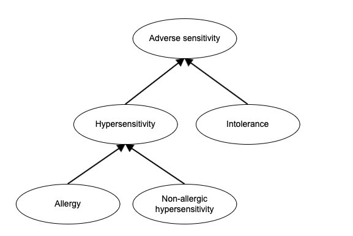

# Appendix A: Glossary of Terms

The following table contains the definition of any terms used within this document.

## Hierarchy of terms:

<figure><figcaption></figcaption></figure>

## Term List:

| **Term**                                  | **Definition**                                                                                                                                                                                                                                                                                                                                                                                                                                                                                                           |
| ----------------------------------------- | ------------------------------------------------------------------------------------------------------------------------------------------------------------------------------------------------------------------------------------------------------------------------------------------------------------------------------------------------------------------------------------------------------------------------------------------------------------------------------------------------------------------------ |
| Adverse sensitivity                       | The propensity to developing an untoward effect to a substance at a dose which is tolerated by normal persons. It encompasses allergic and non-allergic hypersensitivity, intolerance and idiosyncrasy                                                                                                                                                                                                                                                                                                                   |
| Adverse sensitivity test                  | A collective term to encompass sensitivity and sensitization tests                                                                                                                                                                                                                                                                                                                                                                                                                                                       |
| Adverse Reaction                          | An undesirable physiological effect resulting from exposure to a substance.                                                                                                                                                                                                                                                                                                                                                                                                                                              |
| Allergic condition                        | The disposition to develop an allergic reaction, the allergic reaction itself or its consequences                                                                                                                                                                                                                                                                                                                                                                                                                        |
| Allergic disposition                      | The disposition to develop an allergic reaction                                                                                                                                                                                                                                                                                                                                                                                                                                                                          |
| Allergic reaction                         | A pathological immune process generally directed towards a foreign antigen, which results in tissue injury, which is usually transient. It is the realization of the allergic disposition. It is most often applied to type I hypersensitivity but other hypersensitivity types especially type IV (e.g. allergic contact dermatitis) may be involved                                                                                                                                                                    |
| Allergic sensitization                    | A process characterized by a humoral or cell-mediated immune response to a foreign antigen resulting in the production of specific antibodies and/or immune cells which may then lead to an allergic disposition.                                                                                                                                                                                                                                                                                                        |
| Intolerance                               | Any undesirable effect of exposure to low or usual amounts of a substance. Specifically excludes allergy and non-allergic hypersensitivity                                                                                                                                                                                                                                                                                                                                                                               |
| Drug intolerance                          | An undesirable pharmacologic effect that may occur at low or usual doses of the drug. Humoral or cellular immune mechanisms are not thought to be involved, and a scientific explanation for such exaggerated responses has not been established (eg, aspirin-induced tinnitus at low doses). Intolerance encompasses drug idiosyncrasy.                                                                                                                                                                                 |
| Drug idiosyncrasy                         | An abnormal and unexpected effect that is unrelated to the intended pharmacologic action of a drug and has an unknown mechanism. It is not mediated by a humoral or cellular immune response but is reproducible on readministration. It may be due to underlying abnormalities of metabolism, excretion, or bioavailability (eg: quinidine-induced drug fever).                                                                                                                                                         |
| Excipient                                 | An ingredient of a drug formulation that is added for reasons other than the primary therapeutic use of the drug. Excipients include preservatives, antibiotics, various vehicles such as emulsifiers and fillers, preservatives, colorizing agents and flavors.                                                                                                                                                                                                                                                         |
| Food intolerance                          | A food intolerance or a food sensitivity occurs when a person has difficulty digesting a particular food. This can lead to symptoms such as intestinal gas, abdominal pain or diarrhea. A food intolerance is sometimes confused with or mislabeled as a food allergy. Food intolerances involve the digestive system. Food allergies involve the immune system. With a food allergy, even a microscopic amount of the food has the potential to lead to a serious or life-threatening reaction called anaphylaxis. \[2] |
| Hypersensitivity condition                | The disposition to develop an allergic or non-allergic hypersensitivity (pseudoallergic) reaction, the reaction itself or its consequences.                                                                                                                                                                                                                                                                                                                                                                              |
| Hypersensitivity disposition              | The disposition to develop an allergic or non-allergic hypersensitivity (pseudoallergic) reaction                                                                                                                                                                                                                                                                                                                                                                                                                        |
| Hypersensitivity reaction                 | A pathological process initiated by exposure to a defined stimulus at a dose tolerated by normal persons. It is the realization of the disposition to hypersensitivity.                                                                                                                                                                                                                                                                                                                                                  |
| Non-allergic hypersensitivity condition   | The disposition to develop a non-allergic hypersensitivity (pseudoallergic) reaction, the pseudoallergic reaction itself or its consequences                                                                                                                                                                                                                                                                                                                                                                             |
| Non-allergic hypersensitivity disposition | The disposition to develop a non-allergic hypersensitivity (pseudoallergic) reaction                                                                                                                                                                                                                                                                                                                                                                                                                                     |
| Non-allergic hypersensitivity reaction    | A pathological nonimmune process generally directed towards a foreign substance, which results in tissue injury, which is usually transient. It is the realization of the non-allergic hypersensitivity (pseudoallergic) disposition. A variety of mechanisms such as direct histamine release, complement activation, cyclooxygenase activation and bradykinin generation may be involved                                                                                                                               |
| Sensitivity test                          | A test to confirm clinical sensitivity to a particular substance by exposing an individual to that substance and observing for the onset of signs and symptoms consistent with a hypersensitivity reaction. Commonly referred to as a “challenge” test                                                                                                                                                                                                                                                                   |
| Sensitization test                        | A skin or in vitro test to demonstrate an individual has developed an immune response to an allergen. A positive test does not necessarily indicate that an individual is clinically sensitive to that allergen                                                                                                                                                                                                                                                                                                          |

## References:

1. Joint Task Force on Practice Parameters; American Academy of Allergy, Asthma and Immunology; American College of Allergy, Asthma and Immunology; Joint Council of Allergy, Asthma and Immunology. Drug allergy: an updated practice parameter. Ann Allergy Asthma Immunol. 2010 Oct; 105(4):259-273. doi: 10.1016/j.anai.2010.08.002.
2. Thanai Pongdee. Food Allergy Versus Food Intolerance. Published by American Academy of Allergy Asthma & Immunology 02/2011.
