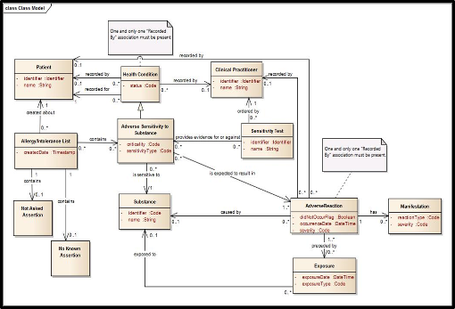

# Appendix D: Analysis of the HL7 Patient Care Domain Analysis Model

This domain analysis model for allergy records was developed by the HL7 Patient Care Work Group and has been used to inform the allergy/intolerance modeling in the C-CDA® and FHIR® specifications.

[http://www.hl7.org/implement/standards/product\_brief.cfm?product\_id=308](http://www.hl7.org/implement/standards/product_brief.cfm?product_id=308)

Patient Care Domain Analysis Model

<figure><figcaption></figcaption></figure>

**Selected attribute definitions**

<table data-header-hidden><thead><tr><th width="230.1640625">Attribute name</th><th width="114.765625">Datatype</th><th>Definition</th></tr></thead><tbody><tr><td><strong>Adverse reaction</strong></td><td></td><td></td></tr><tr><td>severity</td><td>Coded</td><td>Assessment of the severity of the reaction</td></tr><tr><td>didNotOccurFlag</td><td>Boolean</td><td>Indicates a reaction did not occur at contact with substance</td></tr><tr><td>OccurrenceDate</td><td>DateTime</td><td>Time stamp for manifestation of the reaction</td></tr><tr><td><strong>Health condition</strong></td><td></td><td></td></tr><tr><td>status</td><td>Coded</td><td>Current status of the concern</td></tr><tr><td><strong>Adverse sensitivity to substance</strong></td><td></td><td></td></tr><tr><td>criticality</td><td>Coded</td><td>Clinical judgement regarding potential seriousness of a future reaction.</td></tr><tr><td>sensitivityType</td><td>Coded</td><td>Allergy; intolerance</td></tr><tr><td>createdDate</td><td>Date Time</td><td>Date time the entry was created</td></tr><tr><td><strong>Substance</strong></td><td></td><td></td></tr><tr><td>identifier</td><td>Coded</td><td>Coded reference to the substance involved in the reaction</td></tr><tr><td>name</td><td>String</td><td>Name of the substance</td></tr><tr><td><strong>Exposure</strong></td><td></td><td></td></tr><tr><td>exposureDate</td><td>Date Time</td><td>Date time when the exposure occurred; may be approximated</td></tr><tr><td>exposureType</td><td>Coded</td><td>How the exposure occurred, eg vaccination, prescription, administration, accidental</td></tr><tr><td><strong>Manifestation</strong></td><td></td><td></td></tr><tr><td>severity</td><td>Coded</td><td>Severity of the manifestation of the reaction</td></tr><tr><td>reactionType</td><td>Coded</td><td>Clinical finding characterizing the reaction, eg code for rash or hives</td></tr><tr><td><strong>Sensitivity test</strong></td><td></td><td></td></tr><tr><td>identifier</td><td>Identifier</td><td>Identifier pointing to results of the sensitivity test</td></tr><tr><td>name</td><td>String</td><td>Name of the test</td></tr></tbody></table>

<a href="https://docs.google.com/forms/d/e/1FAIpQLScTmbZIf0UEQwYDkY27EEWBkaiYkHSbR0_9DmFrMLXoQLyL7Q/viewform?usp=pp_url&entry.1767247133=Allergy+IG&entry.670899847=Appendix%20D%3A%20Analysis%20of%20the%20HL7%20Patient%20Care%20Domain%20Analysis%20Model" class="button primary">Provide Feedback</a>
