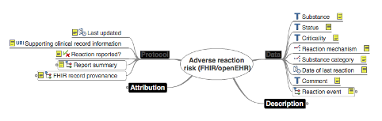

# Appendix G: Analysis of the openEHR information model

Status – the FHIR®/openEHR archetype for Adverse Reaction Risk is in its fourth review round as of November 2015.

[http://www.openehr.org/ckm/](http://www.openehr.org/ckm/) (search for Adverse Reaction Risk)

<figure><figcaption></figcaption></figure>

Data elements that could be encoded incude:

* Substance
* Status
* Criticality
* Reaction mechanism
* Substance category
* Certainty
* Manifestation
* Severity of reaction

## **Purpose**

* To record a clinical assessment of a propensity, or potential risk to an individual, of an adverse reaction upon future exposure to the specified substance, or class of substance
* Where a propensity is identified, to record information or evidence about reaction events that is characterized by any harmful or undesirable physiological response that is unique to the individual, and triggered by exposure of an individual to the identified substance or substance class.

## **Use**

Use to provide a single place within the health record to document a range of clinical statements about adverse reactions, including:

* record a clinical assessment of the individual’s propensity for a potential future reaction upon re-exposure; and
* record cumulative information about the reaction to each exposure
* Use to record information about the positive presence of the risk of an adverse reaction:
  * to support direct clinical care of an individual
  * as part of a managed adverse reaction or allergy/intolerance list
  * to support exchange of information about the propensity and events related to adverse reactions
  * to inform adverse reaction reporting; and
  * to assist computerized knowledge-based activities such as clinical decision support and alerts.

Use to record information about the risk of adverse reactions to a broad range of substances, including:

* incipients and excipients in medicinal preparations
* biological products
* metal salts
* organic chemical compounds

Adverse reaction may be:

* an immune mediated reaction - Types I-VI (including allergic reactions and hypersensitivities)
* a non-immune mediated reaction:
  * pseudo-allergic reactions
  * side effects
  * intolerances
  * drug toxicities

In clinical practice, distinguishing between immune-mediated and non-immune mediated reactions is difficult and often not practical. Identification of the type of reaction is not a proxy for seriousness or risk of harm to the patient, which is better expressed by the manifestation in clinical practice.

The risk of an adverse reaction event or manifestation should not be recorded without identifying a proposed causative substance or class of substance. If there is uncertainty that a specific substance is the cause, this uncertainty can be recorded using the ‘Status’ data element. If there are multiple possible substances that may have caused a reaction/manifestation, each substance should be recorded using a separate instance of this adverse reaction archetype/FHIR® resource with the ‘Status’ set to an initial state of ‘Suspected’ so that adverse reaction checking can be activated in clinical systems. Once the substance, agent or class is later proven not to be the cause for a given reaction then the ‘Status’ can be modified to ‘Refuted’.

This archetype/FHIR® resource has been designed to allow recording of information about a specific substance (amoxicillin, oysters, or bee sting venom) or, alternatively, a class of substance (eg Penicillins)). If a class of substance is recorded then identification of the exact substance can be recorded on a per exposure basis.

The scope of this archetype/FHIR® resource has deliberately focused on identifying a pragmatic data set that are used in most clinical systems or will be suitable for most common clinical scenarios, however it permits extension of the model when additional detail is required, for example 'Reaction details', 'Exposure details', and 'Reporting details' slots. Examples of clinical situations where the extension may be required include: a detailed allergist/immunologist assessment, for reporting to regulatory bodies or use in a clinical trial.

The act of recording any adverse reaction risk in a health record involves the clinical assessment that a potential hazard exists for an individual if they are exposed to the same substance/agent/class in the future – that is, a relative contraindication - and the default ‘Criticality’ value should be set to ‘Low risk’. If a clinician considers that it is not safe for the individual to be deliberately re-exposed to the substance/agent again, for example, following a manifestation of a life-threatening anaphylaxis, then the 'Criticality' data element should be amended to ‘High’.

A formal Adverse Event Report to regulatory bodies is a document that will contain a broad range of information in addition to the specific details about the adverse reaction. The report could utilize parts of this Risk of adverse reaction archetype/FHIR® resource plus include additional data as required per jurisdiction.

An adverse reaction or allergy/intolerance list is a record of all identified propensities for an adverse reaction for the individual upon future exposure to the substance or class, additionally providing potential access to the evidence provided by details about each reaction event, such as manifestation.

Valuable first-level information that could be presented to the clinician when they need to assess propensity for future reactions are:

* statements about previous clinical manifestations following exposure
* source of the information/reporter
* ‘Criticality’ flag.

Second-level information can be drawn from each exposure event and links to additional detailed information such as history, examination and diagnoses stored elsewhere in the record, if it is available.

## Out of scope

The archetype is not to be used for recording physiological reactions to physical agents, such as heat, cold, sunlight, vibration, exercise activity, by infectious agents or food contaminants. Use archetypes/FHIR® resources for Problem/Diagnosis (openEHR) or Conditions (FHIR®).

Not to be used to record adverse events, including failures of clinical process, interventions or products. For example:

* abnormal use or mistakes/errors made in maladministration of an agent or substance
* incorrect dosage
* mislabeling
* harm or injury caused by an intervention or procedure
* overdose or poisoning

Not to be used to record an adverse reaction where the substance is unknown. Use EVALUATION.problem\_diagnosis or CLUSTER.symptoms to record as part of the health record until a possible substance is identified.

Not to be used to record reactions to transfusions of blood products. Use a specific archetype for the purpose.

Not to be used as a proxy for an Adverse Event Report. See above for how it may be used as one component of an Adverse Event Report.

Not to be used for recording alerts.

Not to be used for recording failed therapy.

Not to be used for the explicit recording of an absence (or negative presence) of a reaction to 'any substances' or to identified substances, for example ‘No known allergies or adverse reactions’ or ‘No known allergies to Penicillin’. Use the EVALUATION. exclusion-adverse\_reaction archetype to express a positive statement of adverse reaction exclusion.

Not to be used for the explicit recording that no information could be obtained about the adverse reaction status of a patient. Use the EVALUATION.absence archetype to record that a positive statement that information could not be obtained, for example, if a non-cooperative patient refuses to answer questions.

<a href="https://docs.google.com/forms/d/e/1FAIpQLScTmbZIf0UEQwYDkY27EEWBkaiYkHSbR0_9DmFrMLXoQLyL7Q/viewform?usp=pp_url&entry.1767247133=Allergy+IG&entry.670899847=Appendix%20G%3A%20Analysis%20of%20the%20openEHR%20information%20model" class="button primary">Provide Feedback</a>
