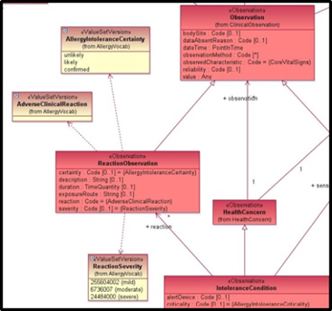
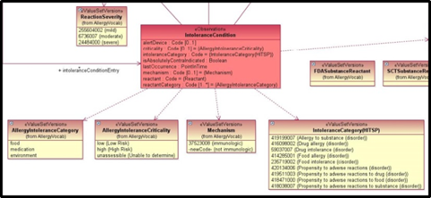

# Appendix H: Analysis of the US Federal Health Information Model

The Federal Health Information Model is a project under a larger program called Federal Health Interoperability Modeling and Standards (FHIMS), which is an initiative of the Federal Health Architecture (FHA). Briefly, the United States federal government has established a Federal Enterprise Architecture (FEA), which provides guidance to federal agencies on how they should develop their enterprise architectures. The methodology used by FEA, the Federal Segment Architecture Methodology (FSAM) recognizes that some "lines of businesses" in which the federal government is engaged cross agency boundaries. The healthcare line of business is one such case. As a result, the FHA was established as a partnership of over 20 departments and agencies to coordinate Healthcare Information Technology (sometimes called Healthcare IT, or HIT) activities among those partners. The FHA is managed by the Office of the National Coordinator for Health IT (ONC). The FHA has served as a forum by which the partner agencies have collaborated on several important initiatives, including the Nationwide Health Information Network.

The FHIMS program is intended to coordinate the efforts of the partner agencies with respect to information and terminology standards, including the coordination of agency efforts at relevant Standards Development Organizations (SDOs) such as Health Level Seven (HL7®), the National Council for Prescription Drug Programs (NCPDP), Integrating the Healthcare Enterprise (IHE), and others.

Another FHIMS initiative is the Federal Health Terminology Model project, which coordinates partner agency efforts to develop healthcare terminology models, and to enumerate "value sets" that can be associated with the Information Model. The Terminology Model is closely related to the Information Model, as they are each describing the same real-world concepts from two different angles”.

The Federal Health Information Model is a UML construct defining classes of data with linked terminological value sets proposed as reference values for attributes in the model. There are two classes proposed which directly relate to documentation of the use cases from chapter 2. _ReactionObservation_ s model the data class describing report of a hypersensitivity reaction event as presented in use case 2.1.1. The _IntoleranceCondition_ s class, as elements of the _IntoleranceConditionList_ , mirror the content of the Allergic Propensity List proposed in use case 2.1.2 to support drug alerting.

**ReactionObservation class:** is a specialization (subtype) of **Observation** and inherits the attributes from that class. “This class documents an Observation of an adverse physiological response attributed to the exposure of the Patient to the given substance. Note that the dates may be unspecified, such as when the Patient reports that she breaks out in hives when she eats peanuts.”

***

**FHIM: ReactionObservation class**

<figure><figcaption></figcaption></figure>

***

Coded attributes from this model which relate to use case 1: “Allergic reaction to hydrochlorothiazide consisting of hives” might be:

<table><thead><tr><th width="221.2578125">Attribute</th><th width="221.24609375">Value</th></tr></thead><tbody><tr><td>observedCharacteristic</td><td>NULL</td></tr><tr><td>bodySite</td><td>“skin”</td></tr><tr><td>observationMethod</td><td></td></tr><tr><td>certainty</td><td>“likely”</td></tr><tr><td>exposureRoute</td><td>“ingested”</td></tr><tr><td>reaction</td><td>“Hives”</td></tr><tr><td>severity</td><td>6736007 |Moderate|</td></tr></tbody></table>

**IntoleranceCondition class:** is a linked artifact to ReactionObservation and “Describes an observation of an ‘Intolerance Condition’ of the Patient. Intolerance Conditions are typically allergies, but the concept of an intolerance condition is broader than just allergies. For example, an adverse reaction such as the patient becomes nauseous after taking a particular antibiotic is not an allergy, but may serve as a contra-indicator to the use of that antibiotic. In general, Intolerance Conditions as caused by Food, Drugs, or some environmental factor such as mold, insect venom (i.e., bee stings), or pet dander”\[3].

**FHIM:IntoleranceCondition class and selected value sets**

<figure><figcaption></figcaption></figure>

Coded attributes from this model which relate to use case 2.1.2: “Propensity for allergic reaction to hydrochlorothiazide with history of hives” might be:

**Class attributes FHIM Intolerance Condition**

| Attribute                   | Value              |
| --------------------------- | ------------------ |
| criticality                 | “high (High risk)” |
| intoleranceCategory         | 419511003          |
| isAbsolutelyContraindicated | “No”               |
| Mechanism                   | 37523008           |
| reactant                    | RxCUI 5487         |
| reactantCategory            | “medication”       |

***
