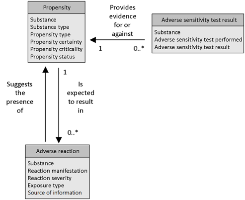

# Appendix I: Inclusive Information Model

After considering reference information models from various standards development organizations and other national or regional sources, this inclusive information model was synthesized. The purpose of the model is to provide a conceptual framework to understand and align the various models but does not replace the individual models. (The details on each of the source information models are available in the [appendices](./))

The image below illustrates the inclusive information model and shows the relationship between the three classes included in the model. The **Propensity** class is the centerpiece. A propensity class may be associated with zero-to-many **Adverse Reaction** classes and zero-to-many **Adverse** **Sensitivity Test Result** classes.

<figure><figcaption>
 Inclusive information model for XXX. A conceptual framework to understand and align the various models.
</figcaption></figure>

The following tables depict the three classes and their data elements. Only data elements specific to the adverse sensitivity use case are shown. Generic data elements such as date, time, patient and provider identifiers are omitted.

**Table: Overview of the propensity class and a description of the associated data elements**

<table data-header-hidden><thead><tr><th width="152.16796875"></th><th></th><th></th></tr></thead><tbody><tr><td><strong>Data element</strong></td><td><strong>Description</strong></td><td><strong>Notes</strong></td></tr><tr><td><strong>Substance</strong></td><td>Represents the specific allergen or other agent/substance to which the patient has an adverse reaction propensity. A substance is a physical material which can mean a drug or biologic, food, chemical agent, plants, animals, plastics etc.</td><td></td></tr><tr><td><strong>Substance type</strong></td><td>Represents the type of substance related to the propensity e.g. drug, food, environment, vaccine etc.</td><td></td></tr><tr><td><strong>Propensity type</strong></td><td>Indicates whether the propensity is an allergy, non-allergic hypersensitivity or intolerance.</td><td></td></tr><tr><td><strong>Propensity certainty</strong></td><td>Indicates whether there is evidence that the propensity has been confirmed. For example, an allergy could be further categorized as: Confirmed - via laboratory testing or witnessed observation or other strong evidence, or Suspected (Unconfirmed) - Patient reported but not further verified by clinical history, diagnostic testing or is uncertain.</td><td></td></tr><tr><td><strong>Propensity criticality</strong></td><td>Indicates the potential seriousness of the propensity for a future reaction. This represents a clinical judgment about the worst-case scenario for a future reaction. It would be based on the severity of past reactions, the dose and route of exposure that produced past reactions, and the life threatening or organ system threatening potential of the reaction type. Criticality is an attribute of the propensity, not the reaction(s).</td><td>Not the same as severity of the reaction, because a severe reaction can be non-critical and vice versa. Assessing criticality may be difficult especially as the notion may be unfamiliar to those providers that are not allergy specialists and who may confuse this element with the severity of a previous or current reaction. For this reason, criticality should be documented with caution.</td></tr><tr><td><strong>Propensity status</strong></td><td>Indicates the current status of the propensity. For example, an allergy may become ‘Resolved’ after de-sensitization (see 6.2 for the discussion about allergy desensitization).</td><td></td></tr></tbody></table>

**Table: Overview of the adverse reaction class and a description of the associated data elements**

<table data-header-hidden><thead><tr><th width="161.64453125"></th><th></th><th></th></tr></thead><tbody><tr><td><strong>Data element</strong></td><td><strong>Description</strong></td><td><strong>Notes</strong></td></tr><tr><td><strong>Substance</strong></td><td>Represents the specific allergen or other agent/substance to which the patient has an adverse reaction propensity. A substance is a physical material which can mean a drug or biologic, food, chemical agent, plants, animals, plastics etc.</td><td></td></tr><tr><td><strong>Reaction manifestation</strong></td><td>Indicates the specific adverse reaction that occurred. Example: Rash, Hives</td><td>A negative entry (e.g., “no adverse reaction observed”) can be used to document an exception to a propensity to a class of substance (e.g., patient has penicillin allergy but can tolerate amoxicillin)</td></tr><tr><td><strong>Reaction severity</strong></td><td>How severe the reaction was</td><td></td></tr><tr><td><strong>Exposure type (route)</strong></td><td>How the exposure occurred. Example: oral, airborn, topical, etc.</td><td></td></tr><tr><td><strong>Source of information</strong></td><td>How the observation was made e.g., patient reported, observed by family member, observed by healthcare professional</td><td></td></tr></tbody></table>

**Table: Overview of the adverse sensitivity class and a description of the associated data elements**

<table data-header-hidden><thead><tr><th></th><th width="502.2109375"></th><th></th></tr></thead><tbody><tr><td><strong>Data element</strong></td><td><strong>Description</strong></td><td><strong>Notes</strong></td></tr><tr><td><strong>Substance</strong></td><td>Represents the specific allergen or other agent/substance to which the patient has an adverse reaction propensity. A substance is a physical material which can mean a drug or biologic, food, chemical agent, plants, animals, plastics etc.</td><td></td></tr><tr><td><strong>Adverse sensitivity test performed</strong></td><td>Represents the specific allergy test being performed ex: LOINC code 6206-7 Peanut IgE Ab [Units/volume] in Serum</td><td></td></tr><tr><td><strong>Adverse sensitivity test result</strong></td><td>Represents the test result</td><td></td></tr></tbody></table>

There were other published allergy and hypersensitivity information models being considered at the initial drafting of this document in 2014, which included epSOS, openEHR, US Federal Health Information Model and UK NHS Connecting for Health Information Model. Their analysis fed into the creation of the inclusive model. Since then, HL7®-related information models, especially FHIR®, have become increasingly popular. Therefore, this document focuses more on these models. The analyses of the other models can be found in the Appendix. Note that the information may not be up-to-date, and some of the projects which created the models may no longer be active (e.g. the epSOS project concluded in 2014).

<a href="https://docs.google.com/forms/d/e/1FAIpQLScTmbZIf0UEQwYDkY27EEWBkaiYkHSbR0_9DmFrMLXoQLyL7Q/viewform?usp=pp_url&entry.1767247133=Allergy+IG&entry.670899847=Appendix%20I%3A%20Inclusive%20Information%20Model" class="button primary">Provide Feedback</a>
